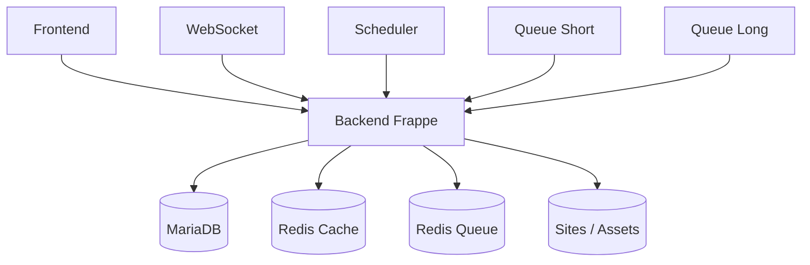

# EPIC 1 — Discovery & Architecture

> ERPNext · Frappe · Docker · mapping Kubernetes

---

## 01 / Objectif

Définir le modèle d'architecture ERPNext avant le provisionnement Azure et le déploiement AKS.

## 02 / Architecture fonctionnelle ERPNext

## 03 / Composants clés

| Domaine | Composant | Rôle |
|---|---|---|
| Application | Frontend | Exposition web ERPNext |
| Application | Backend Frappe | API et logique applicative |
| Application | WebSocket | Temps réel |
| Exécution | Scheduler | Planification des jobs |
| Exécution | queue-short / queue-long | Exécution asynchrone |
| Data | MariaDB | Base transactionnelle |
| Data | Redis cache / queue | Cache et broker de tâches |
| Stockage | Sites | Données partagées applicatives |

## 04 / Mapping Docker vers Kubernetes

| Docker | Kubernetes |
|---|---|
| Container | Pod |
| Compose service | Deployment / StatefulSet |
| Volume | PV / PVC |
| Docker network | CNI + Services |
| DNS Compose | CoreDNS |

## 05 / Cibles techniques préparées

- Découpage stateful/stateless.
- Dépendances inter-services ERPNext.
- Exigences stockage persistant (DB, sites/assets).
- Exposition HTTP/HTTPS via Ingress.
- Trajectoire GitOps pour les déploiements.

## 06 / Compétences

- Architecture ERPNext/Frappe
- Docker Compose
- Modélisation Kubernetes
- Cartographie réseau et persistance
- Préparation migration vers AKS