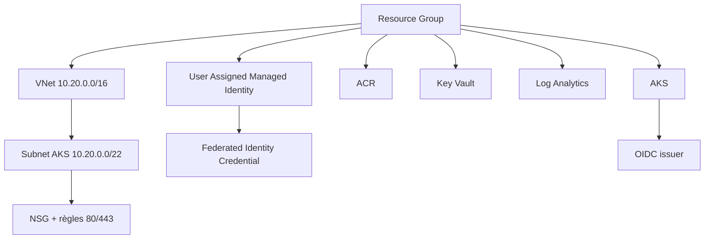

# EPIC 2 — Infrastructure as Code / Terraform

> Azure · Terraform · AKS foundation

---

## 01 / Objectif

Provisionner la base Azure du projet avec Terraform, de façon reproductible et versionnée.

## 02 / Périmètre infrastructure

| Domaine | Ressources |
|---|---|
| Core | Resource Group |
| Réseau | VNet, subnet AKS, NSG, règles HTTP/HTTPS |
| Kubernetes | Cluster AKS (OIDC + Workload Identity activés) |
| Registry | Azure Container Registry (ACR) |
| Sécurité | Key Vault, Managed Identity, Federated Identity Credential |
| Monitoring | Log Analytics Workspace |

## 03 / Topologie Azure

## 04 / Paramètres principaux

| Paramètre | Valeur actuelle |
|---|---|
| Région | westeurope |
| Version AKS | 1.36.3 |
| Node pool system | 2 x Standard_D4s_v3 |
| SKU ACR | Basic |
| Rétention Log Analytics | 30 jours |

## 05 / Sorties Terraform utiles

- resource_group_name
- acr_login_server
- aks_name
- aks_oidc_issuer_url
- key_vault_name
- managed_identity_client_id

## 06 / Points d'architecture

- Terraform couvre exclusivement l'infrastructure Azure.
- Le déploiement applicatif Kubernetes est géré séparément par Helm + Argo CD.
- ACR est provisionné dans la plateforme, indépendamment de la stratégie d'image runtime ERPNext.

## 07 / Compétences

- Terraform AzureRM
- Networking Azure
- AKS
- Managed Identity / OIDC
- Key Vault
- Infrastructure as Code