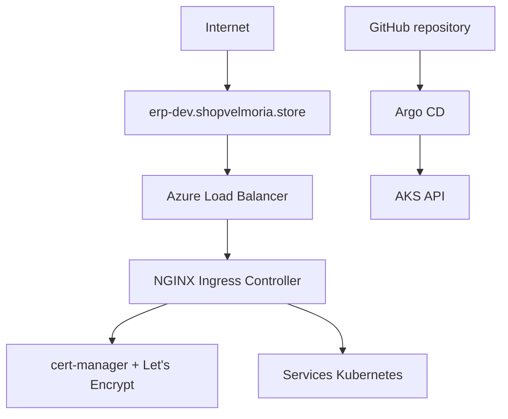

# EPIC 3 — Bootstrap AKS

> NGINX Ingress · cert-manager · Let's Encrypt · Argo CD

---

## 01 / Objectif

Installer les composants de plateforme nécessaires au déploiement GitOps d'ERPNext sur AKS.

## 02 / Architecture bootstrap

## 03 / Composants en place

| Composant | Rôle |
|---|---|
| NGINX Ingress Controller | Point d'entrée HTTP/HTTPS |
| cert-manager | Gestion du cycle de vie certificat TLS |
| ClusterIssuer Let's Encrypt | Émission de certificats ACME |
| Argo CD | Synchronisation GitOps vers AKS |

## 04 / Implémentation

- Certificats staging et production présents.
- ClusterIssuer production et staging définis.
- Configuration Ingress NGINX pilotée par valeurs Helm.
- Application Argo CD déclarée pour suivre la branche main.

## 05 / Flux opérationnels

### Flux trafic

Internet → DNS → Azure Load Balancer → NGINX Ingress → Services Kubernetes

### Flux GitOps

GitHub → Argo CD → Kubernetes API → AKS

## 06 / Limites connues

- La documentation de bootstrap couvre la couche plateforme ; les workloads ERPNext sont détaillés dans l'EPIC 4.
- Le déploiement runtime reste piloté par GitOps, pas par la CI.

## 07 / Compétences

- AKS bootstrap
- Ingress Kubernetes
- cert-manager / ACME
- TLS sur Kubernetes
- Argo CD
- GitOps