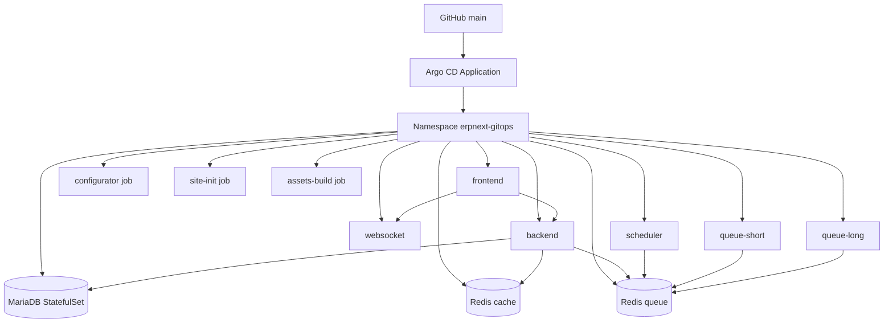

# EPIC 4 — ERPNext sur Kubernetes & GitOps

> Helm · Argo CD · AKS · namespace erpnext-gitops

---

## 01 / Objectif

Déployer ERPNext sur AKS via Helm et GitOps, avec persistance, composants asynchrones et exposition HTTPS.

## 02 / Architecture de déploiement

## 03 / Composants Kubernetes

| Composant | Type | Rôle |
|---|---|---|
| frontend | Deployment | Exposition HTTP applicative |
| backend | Deployment | API Frappe/ERPNext |
| websocket | Deployment | Flux temps réel |
| scheduler | Deployment | Planification jobs |
| queue-short | Deployment | Traitement files courtes |
| queue-long | Deployment | Traitement files longues |
| mariadb | StatefulSet | Persistance SQL |
| redis-cache | Deployment | Cache |
| redis-queue | Deployment | Queue broker |
| configurator | Job PostSync | Configuration bench/site |
| site-init | Job PostSync | Initialisation/synchronisation du site |
| assets-build | Job PostSync | Build et copie des assets |

## 04 / Stockage

| PVC | Taille | StorageClass | AccessMode | Usage |
|---|---|---|---|---|
| mariadb-data | 20Gi | managed-csi | ReadWriteOnce | Données MariaDB |
| sites | 20Gi | azurefile-csi | ReadWriteMany | Sites, assets, partage inter-pods |

## 05 / GitOps

Application Argo CD :
- source : helm/erpnext
- targetRevision : main
- destination namespace : erpnext-gitops
- automated sync : activé
- selfHeal : true
- prune : true

Hooks Argo CD présents sur les Jobs critiques :
- argocd.argoproj.io/hook: PostSync
- hook-delete-policy: BeforeHookCreation,HookSucceeded

## 06 / Réseau et exposition

- Ingress class : nginx
- Host : erp-dev.shopvelmoria.store
- TLS secret : erpnext-production-tls
- Redirection HTTP vers HTTPS
- HSTS activé

Flux principal :

Internet → DNS → Azure Load Balancer → NGINX Ingress → frontend → backend → MariaDB / Redis

## 07 / Image applicative

- Image runtime ERPNext : frappe/erpnext:v16.35.0
- Source : registre public
- Dockerfile custom ERPNext : absent au repository root
- Push ACR image ERPNext : non utilisé dans le flux actuel

## 08 / Limites connues

- Les règles NetworkPolicy sont définies côté manifests GitOps ; leur enforcement dataplane n'est pas démontré dans le LAB.
- Aucun CronJob ERPNext n'est défini dans les manifests actuels.

## 09 / Compétences

- Helm charting
- Argo CD
- GitOps
- Workloads Kubernetes stateful/stateless
- Ingress/TLS
- Stockage CSI sur AKS