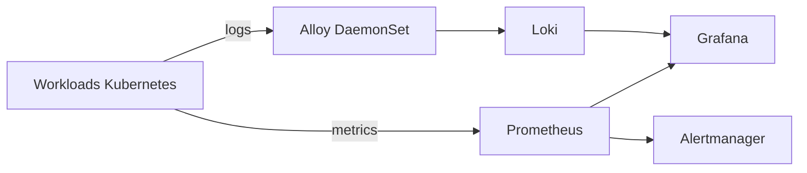

# EPIC 5 — Observabilité ERPNext & AKS

> 📊 Prometheus · Grafana · Loki · Alloy · Alertmanager

---

## 01 / Objectif

Superviser ERPNext sur AKS avec un socle métriques, logs et alertes exploitable en production.

## 02 / Architecture

## 03 / Composants

| Composant | Rôle |
|---|---|
| Prometheus (kube-prometheus-stack) | Collecte des métriques cluster et workloads |
| Grafana | Dashboards et exploration logs |
| Alertmanager | Gestion des alertes Prometheus |
| Loki | Stockage et requêtes logs |
| Alloy | Collecte logs Kubernetes vers Loki |
| kube-state-metrics | Exposition métriques objets Kubernetes |
| node-exporter | Métriques nœuds |

## 04 / Configuration actuelle

| Élément | Valeur |
|---|---|
| Rétention Prometheus | 7 jours |
| Loki mode | Monolithic |
| Loki storage | filesystem |
| Loki singleBinary replicas | 1 |
| Loki read/write/backend | 0 / 0 / 0 |
| Alloy mode | DaemonSet |

## 05 / Alertes ERPNext et infrastructure

Règles définies :
- ERPNextDeploymentUnavailable
- ERPNextMariaDBUnavailable
- ERPNextPodCrashLooping
- ERPNextPodRestarting
- AKSNodeHighCPU
- AKSNodeHighMemory
- PersistentVolumeAlmostFull

## 06 / Points d'exploitation

- Corrélation métriques/logs depuis Grafana.
- Couverture workloads ERPNext + signaux infra AKS.
- Alertmanager alimenté par PrometheusRule dédiée ERPNext.

## 07 / Limites connues

- Loki en monolithique et stockage filesystem : adapté au LAB, non dimensionné pour une volumétrie élevée.
- Les findings Trivy de configuration restent des éléments à traiter en continu.

## 08 / Compétences

- SRE fundamentals
- Prometheus / Alertmanager
- Loki / Alloy
- Dashboards Grafana
- Observabilité Kubernetes