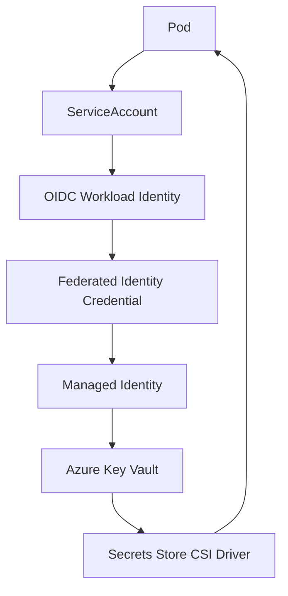

# EPIC 6 — Sécurité Kubernetes & Azure

> 🔐 PSS · RBAC · NetworkPolicies · Key Vault · Workload Identity

---

## 01 / Objectif

Réduire la surface d'exposition d'ERPNext sur AKS au niveau runtime, identité, secrets et transport.

## 02 / Contrôles implémentés

| Domaine | Implémentation |
|---|---|
| Pod hardening | runAsNonRoot, runAsUser=1000, allowPrivilegeEscalation=false, drop ALL, seccomp RuntimeDefault |
| Pod Security Standards | Mode audit/warn sur namespace applicatif |
| RBAC | ServiceAccount dédiée + Role/RoleBinding namespaced |
| Réseau | Default deny ingress/egress + politiques ciblées ERPNext |
| Identité cloud | AKS Workload Identity + OIDC + Managed Identity |
| Secrets | Key Vault + Secrets Store CSI Driver + SecretProviderClass |
| Transport | HTTPS, cert-manager, Let's Encrypt, redirection HTTP→HTTPS, HSTS |

## 03 / Flux identité et secrets

## 04 / Implémentation Kubernetes

- ServiceAccount erpnext-workload.
- Annotation Workload Identity côté ServiceAccount.
- SecretProviderClass Azure conditionnel côté chart Helm.
- Montages CSI secrets-store activables via values Key Vault.
- Règles NetworkPolicy dédiées : frontend, backend, mariadb, redis, workers, websocket, DNS.

## 05 / HTTPS

- Ingress class nginx.
- ClusterIssuer Let's Encrypt.
- Certificat TLS dédié au domaine applicatif.
- En-têtes HSTS configurés côté annotations Ingress.

## 06 / Limites connues

- Les politiques réseau sont déclarées et versionnées.
- L'enforcement effectif NetworkPolicy n'est pas démontré dans le dataplane réseau actuel du LAB.

## 07 / Compétences

- Kubernetes hardening
- RBAC
- Workload Identity
- Key Vault + CSI Driver
- Sécurité réseau Kubernetes
- TLS Kubernetes