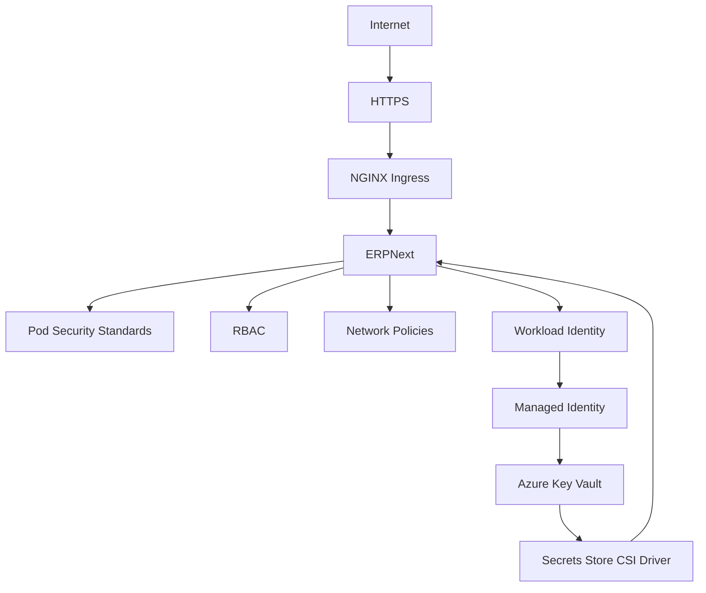

# EPIC 6 — Sécurité

## Objectif
Sécuriser l'environnement ERPNext Kubernetes sur AKS à travers plusieurs mécanismes de sécurité Kubernetes et Azure.

## Travaux réalisés

### LAB-45 — Pod Security Standards
- SecurityContext appliqué aux workloads ERPNext.
- `runAsNonRoot` activé.
- UID `1000` pour les workloads Frappe.
- `allowPrivilegeEscalation: false`.
- Capabilities avec `drop: ALL`.
- `seccompProfile: RuntimeDefault`.
- Audit/Warn PSS appliqués sur le namespace.

MariaDB et Redis ont nécessité une configuration différente afin de préserver leur fonctionnement.

### LAB-46 — RBAC
- ServiceAccount dédié `erpnext-workload`.
- Role namespaced.
- RoleBinding.
- Principe du least privilege.
- Accès limité aux ressources strictement nécessaires.

### LAB-47 — Network Policies
- Default deny ingress.
- Default deny egress.
- Règles explicites entre frontend, backend, MariaDB, Redis, workers, websocket et DNS.
- Segmentation des communications ERPNext.

> Les NetworkPolicies ont été implémentées et validées au niveau Kubernetes/GitOps. L'environnement AKS utilisé pour ce lab ne disposait pas d'un dataplane assurant leur enforcement effectif.

### LAB-48 — Azure Key Vault & Managed Identity
- Azure Key Vault intégré.
- User Assigned Managed Identity utilisée.
- AKS Workload Identity activé.
- OIDC configuré.
- Federated Credential mise en place.
- ServiceAccount Kubernetes utilisé pour l'identité workload.
- Secrets Store CSI Driver intégré.
- Aucun credential Azure statique dans les Pods.

### LAB-49 — HTTPS & Secret Rotation
- HTTPS via NGINX Ingress.
- cert-manager intégré.
- Let's Encrypt utilisé pour les certificats.
- Redirection HTTP → HTTPS.
- HSTS configuré.
- Secret de démonstration stocké dans Azure Key Vault.
- SecretProviderClass utilisé pour la récupération des secrets.
- CSI Driver utilisé pour le montage/synchronisation des secrets.
- Rotation du secret démontrée sans exposition de sa valeur.
- Aucun mot de passe MariaDB réel modifié.

## Architecture de sécurité

## Conclusion
L'EPIC 6 a permis d'établir une base sécurité cohérente pour ERPNext sur AKS, en combinant durcissement Kubernetes (PSS, RBAC, segmentation réseau), gestion d'identité cloud-native (Workload Identity) et gestion sécurisée des secrets (Key Vault + CSI), complétée par un plan HTTPS opérationnel et la démonstration de rotation de secret.
