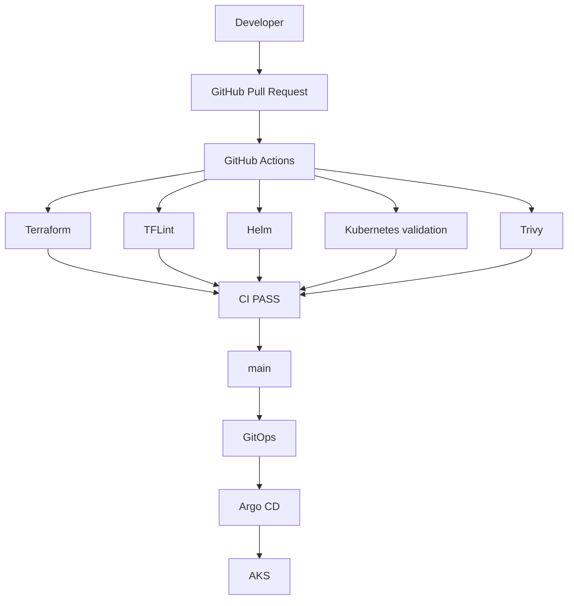

# EPIC 8 — Industrialisation

## 1. Objectif

L'objectif de cette EPIC est de mettre en place une chaîne de validation continue cohérente avec l'architecture réelle du projet ERPNext. La CI permet de détecter tôt les erreurs de configuration Terraform, Helm et Kubernetes, ainsi que les problèmes de sécurité remontés par Trivy, avant qu'un changement n'atteigne la branche `main`.

Dans ce LAB, GitHub Actions valide le code et les manifests. Le déploiement reste sous la responsabilité du modèle GitOps avec Argo CD.

## 2. Architecture CI/CD

Le workflow GitHub Actions couvre la validation continue. Le déploiement n'est pas exécuté par la CI. Après validation et fusion sur `main`, Argo CD reste l'agent de synchronisation vers AKS.

## 3. GitHub Actions

Le workflow de référence est [`.github/workflows/ci.yml`](../.github/workflows/ci.yml).

Jobs principaux observés :

- `image-strategy` : documente explicitement que l'image officielle ERPNext est utilisée et qu'aucun build custom ni push ACR n'est exécuté.
- `terraform` : exécute `terraform fmt -check`, `terraform init -backend=false`, `terraform validate`, puis `tflint`.
- `helm` : valide le chart ERPNext local et les valeurs observability contre des charts upstream épinglés.
- `kubernetes` : dépend de `helm`, rend les manifests, puis effectue une validation offline avec `kubectl --dry-run=client --validate=false`.
- `security` : exécute Trivy en scan filesystem/configuration et charge le résultat SARIF.

Dépendances observées :

- `kubernetes` dépend de `helm`.
- Les autres jobs de validation sont indépendants.
- Aucun job GitHub Actions n'effectue le déploiement GitOps. Argo CD intervient hors workflow CI.

## 4. Terraform CI

Contrôles exécutés localement et présents dans la CI :

- `terraform fmt -check -recursive`
- `terraform init -backend=false -input=false`
- `terraform validate`
- `tflint --init`
- `tflint`

Résultats observés :

- `terraform fmt -check` : PASS
- `terraform init -backend=false` : PASS
- `terraform validate` : PASS
- `tflint --init` : PASS
- `tflint` : PASS

La CI n'exécute aucun `terraform apply`. Elle valide uniquement la forme et la cohérence de la configuration présente dans [infrastructure/terraform](../infrastructure/terraform).

## 5. Helm CI

Contrôles exécutés :

- `helm lint helm/erpnext`
- `helm template erpnext helm/erpnext -f helm/erpnext/values.yaml --namespace erpnext`

Pour l'observabilité, le workflow ne lint pas directement [helm/observability](../helm/observability), car ce dossier ne contient pas de chart Helm autonome. Il contient des fichiers de values. Le workflow télécharge donc les charts upstream épinglés, puis exécute :

- `helm lint <chart upstream> -f helm/observability/loki-values.yaml`
- `helm lint <chart upstream> -f helm/observability/prometheus-values.yaml`
- `helm lint <chart upstream> -f helm/observability/alloy-values.yaml`
- `helm template` sur ces mêmes charts

Résultats observés :

- `helm lint helm/erpnext` : PASS
- `helm lint helm/observability` : FAIL attendu, car `Chart.yaml` est absent dans ce dossier values-only
- Lint workflow-compatible avec charts upstream : PASS
- `helm template` ERPNext et observability : PASS

Les charts sont validés sans aucun déploiement sur cluster.

## 6. Kubernetes validation

Le workflow utilise une validation offline reproduite localement :

- rendu des manifests avec `helm template`
- démarrage d'un faux serveur d'API Kubernetes local
- validation avec `kubectl apply --dry-run=client --validate=false`

Résultat observé : PASS pour les manifests ERPNext, Loki, Prometheus et Alloy.

Limites de cette validation offline :

- elle vérifie la forme des manifests rendus
- elle ne remplace pas une validation contre un cluster réel
- elle ne valide pas les admission webhooks, les policies effectives du cluster ni le comportement runtime

## 7. Trivy

Le workflow exécute un scan Trivy de type filesystem avec remontée SARIF. Localement, un scan `fs` avec scanners `vuln,misconfig` et filtre `HIGH,CRITICAL` a été exécuté pour refléter l'intention du workflow.

Résultats observés :

- `targets=74`
- `vulnerabilities=0`
- `misconfigurations=71`

Objectif du scan :

- détecter des problèmes de sécurité et de configuration dans le repository
- publier des résultats exploitables côté sécurité
- fournir une visibilité sans déclencher de déploiement ni de mutation d'infrastructure

## 8. Image Strategy

Image actuelle :

`frappe/erpnext:v16.35.0`

Référence vérifiée dans [helm/erpnext/values.yaml](../helm/erpnext/values.yaml).

Registry :

`public registry`

Dockerfile custom :

`absent`

Conséquences actuelles :

- Docker build : `NOT APPLICABLE`
- Custom image scan : `NOT APPLICABLE`
- ACR push : `NOT APPLICABLE`

L'ACR existe toujours dans Terraform comme capacité future. Il n'est pas utilisé pour recopier artificiellement l'image officielle ERPNext tant qu'aucune image custom n'est construite par ce repository.

## 9. GitOps

Le flux de déploiement visé est :

`GitHub -> GitOps -> Argo CD -> AKS`

La définition Argo CD observée dans [K8S/argocd/erpnext-application.yaml](../K8S/argocd/erpnext-application.yaml) suit la branche `main` et le chart ERPNext.

Points confirmés :

- GitHub Actions ne fait pas de `kubectl apply` sur un cluster réel ; il effectue uniquement un `kubectl ... apply --dry-run=client --validate=false` offline
- GitHub Actions ne fait pas de `helm upgrade`
- Argo CD reste responsable du déploiement

## 10. Tests

| Contrôle | Résultat | Commentaire |
|---|---|---|
| Terraform fmt | PASS | `terraform fmt -check -recursive` validé localement |
| Terraform validate | PASS | `terraform init -backend=false` puis `terraform validate` réussis |
| TFLint | PASS | `tflint --init` puis `tflint` réussis |
| Helm lint | PASS | `helm/erpnext` passe, et l'observability passe via charts upstream épinglés |
| Helm template | PASS | rendu ERPNext, Loki, Prometheus et Alloy réussi |
| Kubernetes validation | PASS | validation offline par `kubectl --dry-run=client --validate=false` réussie |
| Trivy | PASS | scan exécuté, 0 vulnérabilité et 71 misconfigurations HIGH/CRITICAL observées |
| Image build | N/A | No custom Dockerfile |
| Image scan | N/A | No custom image |
| ACR push | N/A | No custom image |

## 11. Negative tests

Tests d'échec réellement effectués dans des copies temporaires hors repository :

1. Terraform

- Contrôle testé : `terraform validate`
- Erreur injectée : bloc `terraform {` non fermé dans un fichier temporaire
- Résultat : échec attendu avec message `Unclosed configuration block`
- Restauration : suppression complète de la copie temporaire

2. Helm

- Contrôle testé : `helm lint`
- Erreur injectée : template temporaire avec `{{ if .Values.invalid }}` sans fermeture
- Résultat : échec attendu avec `unexpected EOF`
- Restauration : suppression complète de la copie temporaire

3. Observability root

- Contrôle testé : `helm lint helm/observability`
- Erreur attendue : absence de `Chart.yaml`
- Résultat : échec observé, cohérent avec la structure values-only du dossier
- Restauration : aucune nécessaire, aucun fichier du repository n'a été modifié

## 12. Sécurité CI/CD

Éléments observés dans [`.github/workflows/ci.yml`](../.github/workflows/ci.yml) :

- permissions GitHub : `contents: read` et `security-events: write`
- scan Trivy activé
- absence de secrets Azure inutiles pour le flux actuel
- absence de credentials statiques Docker ou Azure dans le workflow actuel
- principe du moindre privilège respecté côté permissions GitHub Actions

Il n'y a pas d'authentification OIDC GitHub vers Azure utilisée pour ACR dans le flux actuel. Elle n'est pas nécessaire tant qu'aucun push vers ACR n'est exécuté.

## 13. Ce qui est automatisé

Sont automatisés par le workflow CI :

- validation YAML du workflow
- vérifications Terraform de structure et de validité
- lint Terraform avec TFLint
- lint et rendu Helm
- validation offline des manifests Kubernetes rendus
- scan de sécurité filesystem/configuration avec Trivy
- publication du statut de stratégie d'image

## 14. Ce qui reste hors CI

Restent hors du périmètre de la CI :

- `terraform apply`
- opérations Azure réelles
- déploiement AKS direct
- synchronisation Argo CD
- futur build d'image custom si le projet évolue

## 15. Limites du LAB

Limites observées :

- validation Kubernetes offline uniquement
- absence de Dockerfile custom ERPNext
- absence de push ACR dans le flux réel
- `helm/observability` n'est pas un chart local lintable sans passer par les charts upstream
- les logs détaillés GitHub Actions des runs publics échoués ne sont pas accessibles dans cet environnement sans authentification, seules les métadonnées publiques et annotations visibles ont été exploitées

## 16. Compétences acquises

- GitHub Actions
- CI/CD
- Terraform CI
- TFLint
- Helm validation
- Kubernetes validation
- Trivy
- GitOps
- Argo CD
- image strategy
- security scanning

## 17. Conclusion

Pour le périmètre du LAB, l'EPIC 8 est validée. Le workflow CI reflète désormais l'architecture réelle du projet, la stratégie d'image officielle ERPNext est documentée sans ambiguïté, les validations locales reproductibles ont été exécutées, et la séparation entre CI et déploiement GitOps via Argo CD est conservée.

## Annexe — Observations GitHub Actions

Les runs publics récemment observés via l'API et les pages GitHub montrent :

- run `37136691942` sur le commit `8902294` : `success`
- run `37068009688` sur le commit `3f9e2bc` : `failure` avec annotation publique `Invalid workflow file: .github/workflows/ci.yml#L462`
- run `37067239547` sur le commit `82af735` : `failure` avec annotation publique `Invalid workflow file: .github/workflows/ci.yml#L471`

Corrections observables :

- les échecs publics consultables étaient liés à une syntaxe YAML invalide du workflow
- la correction finale publiée dans le commit `8902294` a conduit à un run public en succès
