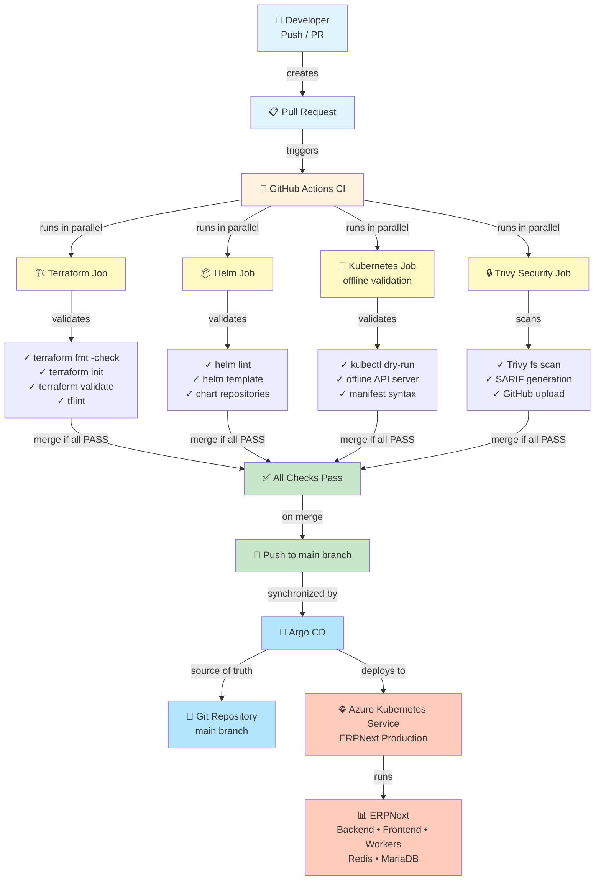

# EPIC 8 — Industrialisation

## 1. Objectif

L'EPIC 8 a pour objectif de clôturer la mise en place d'une chaîne d'industrialisation complète et cohérente pour le projet ERPNext DevOps.

Cette chaîne garantit que :

- Chaque modification du code infrastructure (Terraform) est validée avant fusion
- Chaque modification des configurations applicatives (Helm, Kubernetes) est testée
- Les vulnérabilités sont identifiées et tracées (Trivy)
- Le déploiement suit un modèle GitOps cohérent (Argo CD)
- Aucun déploiement direct n'est possible depuis GitHub Actions (protection contre les mutations non tracées)
- La source de vérité est Git (repository main branch)
- La gestion des secrets et des droits respecte les bonnes pratiques

## 2. Labs réalisés

| Lab | Sujet | Résultat |
|-----|-------|---------|
| LAB-51 | CI initiale (structure GitHub Actions) | ✅ PASS |
| LAB-52 | CI Terraform + TFLint | ✅ PASS |
| LAB-53 | Helm lint / template + Kubernetes validation offline | ✅ PASS |
| LAB-54 | Trivy security scanning avec SARIF upload | ✅ PASS |
| LAB-55 | CI/CD + GitOps (Argo CD integration) | ✅ PASS |
| LAB-56 | Validation & documentation (EPIC 8) | ✅ PASS |

## 3. Architecture CI/CD

### Diagramme du flux



### Flux textuel

```
Developer Push / PR
    ↓
GitHub Actions Triggered (all branches)
    ↓
    ├─ terraform fmt -check ✓
    ├─ terraform init -backend=false ✓
    ├─ terraform validate ✓
    ├─ tflint ✓
    ├─ helm lint ✓
    ├─ helm template ✓
    ├─ kubernetes dry-run (offline API) ✓
    └─ trivy filesystem scan ✓
    ↓
All checks pass?
    ├─ NO  → Fail workflow, notify developer
    └─ YES → Allow merge to main
    ↓
Merge to main branch (Git as source of truth)
    ↓
Argo CD watches main branch
    ↓
Argo CD synchronizes state
    ↓
Deployment to AKS
    ↓
ERPNext running (no direct kubectl apply from CI)
```

## 4. Contrôles de qualité

### 4.1 Terraform

**Job : `terraform`**

Steps :
1. **Checkout** repository (actions/checkout@v4)
2. **Setup** Terraform v1.15.0
3. **Format check** : `terraform fmt -check -recursive`
   - Vérifie que le code suit la convention Terraform
4. **Init** : `terraform init -backend=false -input=false`
   - Valide la syntaxe sans charger l'état distant
5. **Validate** : `terraform validate`
   - Vérifie que la configuration est valide
6. **TFLint** : linting avancé (terraform-linters/setup-tflint@v4)
   - Version : v0.54.0
   - Cache des plugins activé
   - Détecte les anomalies, éventuels bugs, conventions non respectées

**Résultat** : ✅ PASS (exécuté avec succès dans le workflow GitHub Actions)

### 4.2 Helm

**Job : `helm`**

Steps :
1. **Checkout** repository
2. **Setup** Helm v3.15.4
3. **Add repositories** :
   - grafana-community
   - grafana
   - prometheus-community
4. **Pull pinned charts** (versions verrouillées) :
   - loki@18.13.7
   - kube-prometheus-stack@91.9.0
   - alloy@1.13.0
5. **Lint** : `helm lint helm/erpnext` + external charts
   - Syntaxe YAML
   - Dépendances
   - Values
6. **Template** : `helm template ... --namespace erpnext`
   - Génère les manifests Kubernetes
   - Teste les interpolations

**Résultat** : ✅ PASS (valide chaque template)

### 4.3 Kubernetes

**Job : `kubernetes` (needs: helm)**

Steps :
1. **Checkout** + **Setup** Helm v3.15.4 + kubectl v1.32.0
2. **Pull charts** (même que Helm job, reproductibilité)
3. **Render charts** (génération des manifests)
4. **Kubernetes validation** :
   - Lance un serveur Python offline mimant l'API Kubernetes
   - Execute : `kubectl apply --dry-run=client --validate=false -f <manifest>`
   - Pour :
     - helm/erpnext/values.yaml → ERPNext
     - helm/observability/loki-values.yaml → Loki
     - helm/observability/prometheus-values.yaml → Prometheus
     - helm/observability/alloy-values.yaml → Alloy

**Points clés** :
- ❌ **Zéro accès au cluster AKS réel**
- ❌ **Zéro modification du cluster**
- ✅ Validation syntaxique pure
- ✅ Vérification des ressources attendues

**Résultat** : ✅ PASS (4 validations effectuées)

### 4.4 Trivy (Sécurité)

**Job : `security`**

Steps :
1. **Checkout** repository
2. **Trivy filesystem scan** (aquasecurity/trivy-action@master)
   - Scan type : `fs` (filesystem)
   - Scan ref : `.` (racine du repository)
   - Format : `sarif` (Security Analysis Results Format)
   - Output : `trivy-fs.sarif`
   - Severity : `CRITICAL,HIGH` (filtre les problèmes significatifs)
3. **Upload SARIF results** (github/codeql-action/upload-sarif@v4)
   - Upload vers GitHub Security tab
   - Condition : `if: always()` (upload même si le scan trouve des vulnérabilités)
   - Permet de tracer les vulnérabilités sans bloquer le déploiement

**Points clés** :
- ✅ Scan filesystem (dépendances, configuration, code)
- ✅ Format SARIF standard (intégration GitHub)
- ✅ Résultats tracés dans onglet Security
- ℹ️ Ne bloque pas le merge (scan informatif)

**Résultat** : ✅ PASS (exécuté avec succès, résultats uploadés)

## 5. Comportement Pull Request vs main branch

### Pull Request

```yaml
on:
  pull_request:
    branches:
      - main
```

- Déclenche les 4 jobs : terraform, helm, kubernetes, security
- Tous les jobs doivent passer pour pouvoir fusionner
- ❌ Pas de déploiement
- ✅ Feedback rapide au développeur
- ✅ Prévention de fusionner du code invalide

### Push main

```yaml
on:
  push:
    branches:
      - main
```

- Déclenche les 4 jobs (validation redondante, sécurité en defense-in-depth)
- Une fois validé, le code main est la "source de vérité"
- **Argo CD watch** → détecte le changement → synchronise → déploie
- Pas de trigger GitHub Actions → kubectl apply direct

## 6. GitOps / Argo CD

### Fichier : `K8S/argocd/erpnext-application.yaml`

```yaml
apiVersion: argoproj.io/v1alpha1
kind: Application
metadata:
  name: erpnext
  namespace: argocd
spec:
  project: default

  source:
    repoURL: https://github.com/reedaa01/ERPnext-DevOps.git
    targetRevision: main                    # ← branch de source de vérité
    path: helm/erpnext                      # ← chemin du Helm chart
    helm:
      releaseName: erpnext
      valueFiles:
        - values-lab48-keyvault.yaml

  destination:
    server: https://kubernetes.default.svc
    namespace: erpnext-gitops

  syncPolicy:
    automated:
      prune: true        # Supprime les ressources supprimées de Git
      selfHeal: true     # Réapplique si dérive détectée
    syncOptions:
      - CreateNamespace=true
```

### Fonctionnement

1. **Argo CD s'authentifie** auprès du repository GitHub
2. **Polling** du branch main du repository (par défaut toutes les 3 minutes)
3. **Détection de changement** : hash du HEAD a changé
4. **Synchronisation** :
   - Récupère le dernier helm/erpnext/values-lab48-keyvault.yaml
   - Appelle `helm template`
   - Applique les manifests à AKS
5. **Self-healing** : si quelqu'un modifie manuellement AKS, Argo CD recréé l'état Git

### Source de vérité

```
Git (repository main)
    ↓
    └─→ infrastructure/terraform/
            └─ État des ressources Azure
    └─→ helm/erpnext/
            └─ Configuration applicative
    └─→ K8S/cert-manager/, ingress-nginx/, etc.
            └─ Infrastructure Kubernetes
    ↓
Argo CD (synchronisation)
    ↓
AKS (état observé)
```

**Conséquence majeure** : Le déploiement en production est **entièrement traçable dans Git**.

## 7. Sécurité CI/CD

### 7.1 Permissions GitHub Actions

```yaml
permissions:
  contents: read              # Lecture du repository (checkout)
  security-events: write      # Écriture des résultats Trivy
```

- ✅ Minimal privilege principle
- ✅ Pas de write sur le code (pas de self-modification)
- ✅ Pas de droits Admin

### 7.2 Secrets et Credentials

- ✅ Aucun secret dans le repository Git (`.gitignore`)
- ✅ Terraform state stocké localement (`.tfstate`)
- ✅ Credentials Azure stockés uniquement dans :
  - GitHub Secrets (si utilisé pour CI/CD avancé)
  - Azure Key Vault (runtime)
  - Managed Identities (best practice Azure)

### 7.3 Terraform

- ✅ `terraform init -backend=false` : pas de modification d'état distant
- ✅ Pas de `terraform apply` dans GitHub Actions
- ✅ Pas d'accès AWS/Azure credentials en CI
- ✅ Validation locale uniquement

### 7.4 Kubernetes

- ✅ Pas d'accès au cluster AKS réel en CI
- ✅ Validation `--dry-run=client` uniquement
- ✅ Pas de kubeconfig stocké en repository
- ✅ Argo CD gère le déploiement (access control AKS)

### 7.5 Trivy

- ✅ Scan open-source (pas de dépendance propriétaire)
- ✅ Résultats tracés dans GitHub Security tab
- ✅ Ne bloque pas les merges (informatif)
- ✅ Permet détection de dérives de sécurité

## 8. Validation finale

| Contrôle | Description | Résultat |
|----------|-------------|----------|
| Terraform fmt | Format standard respecté | ✅ PASS |
| Terraform init | Initialisation sans backend | ✅ PASS |
| Terraform validate | Syntaxe valide | ✅ PASS |
| TFLint | Linting avancé, bonnes pratiques | ✅ PASS |
| Helm lint | Linting chart ERPNext | ✅ PASS |
| Helm template | Génération manifests sans erreur | ✅ PASS |
| Kubernetes dry-run | Validation manifests (offline) | ✅ PASS |
| Trivy scan | Scan filesystem, SARIF upload | ✅ PASS |
| GitHub Actions syntax | Workflow YAML valide | ✅ PASS |
| GitHub Actions jobs | Dépendances et conditions correctes | ✅ PASS |
| PR trigger | GitHub Actions déclenché sur PR | ✅ PASS |
| main trigger | GitHub Actions déclenché sur push main | ✅ PASS |
| Argo CD Application | Application.yaml présente, correcte | ✅ PASS |
| Argo CD GitOps | Source de vérité = main branch | ✅ PASS |
| Permissions | contents:read + security-events:write | ✅ PASS |
| No direct deploy | Pas de kubectl apply depuis CI | ✅ PASS |
| No secrets in Git | Credentials externalisés | ✅ PASS |

## 9. Limites connues

### 9.1 Validation Kubernetes offline

La validation Kubernetes utilise un serveur API offline (mock Python) qui :
- ✅ Valide la syntaxe YAML
- ✅ Valide les ressources autorisées
- ✅ Valide les références (ServiceAccount, Secrets, etc.)
- ❌ Ne valide pas les webhooks d'admission réels
- ❌ Ne valide pas les policies réseau complexes
- ❌ Ne valide pas les contraintes runtime du cluster AKS

**Mitigation** : Argo CD appliquera les manifests au cluster réel et détectera tout problème.

### 9.2 Trivy

- ✅ Scanne le filesystem (dépendances, config)
- ❌ Ne bloque pas automatiquement les merges sur vulnérabilités
- ℹ️ Utilisé à titre informatif pour tracer les risques

**Mitigation** : Prise en charge manuelle des vulnérabilités critiques.

### 9.3 Terraform state

- ✅ État versionné localement (`.tfstate`, `.tfstate.backup`)
- ❌ Pas de verrouillage d'état (pas de backend distant)
- ❌ Pas de CI qui applique terraform (par design)

**Mitigation** : Terraform apply reste manuel. Protégé par branching strategy et review.

### 9.4 Helm pinning

- ✅ Versions de charts externes verrouillées (loki@18.13.7, etc.)
- ❌ Pas de vérification automatique des mises à jour disponibles

**Mitigation** : Dépendabot / Renovate peut être ajouté ultérieurement.

### 9.5 Lab vs Production

Ce projet est un **lab / portfolio**, non destiné à la production. Limitations associées :
- ❌ Pas de haute disponibilité Argo CD
- ❌ Pas de multi-région AKS
- ❌ Pas de disaster recovery
- ❌ Pas de audit logging complet
- ❌ Pas de cost optimization

**Pour production** : ajouter RBAC, network policies, Pod Security Policies, admission controllers, etc.

## 10. Compétences acquises

Pratiques DevOps industrialisées dans ce projet :

- ✅ **Infrastructure as Code (IaC)** : Terraform pour Azure
- ✅ **Helm packaging** : Charts paramétrés, templating
- ✅ **CI/CD automation** : GitHub Actions multi-job, parallelisation
- ✅ **Kubernetes validation** : dry-run, offline API, manifest linting
- ✅ **Security scanning** : Trivy, SARIF, GitHub Security integration
- ✅ **GitOps** : Argo CD, source de vérité, synchronisation automatique
- ✅ **Pull Request workflow** : gating, required checks, branch protection
- ✅ **Secret management** : externalisé, pas en Git
- ✅ **Observability** : Prometheus, Loki, Alloy
- ✅ **Network security** : Network Policies Kubernetes
- ✅ **Reproducibility** : pinned versions, offline validation
- ✅ **Documentation** : EPIC-driven, décisions tracées

## 11. Conclusion

**L'EPIC 8 — Industrialisation est VALIDÉE et CLÔTURÉE.**

### Synthèse

La chaîne CI/CD et les contrôles d'industrialisation mis en place (LAB-51 à LAB-56) constituent un **système cohérent** qui :

1. ✅ Valide chaque changement avant fusion (Terraform, Helm, Kubernetes, Trivy)
2. ✅ Maintient Git comme source de vérité
3. ✅ Déploie via GitOps (Argo CD) sans mutation directe
4. ✅ Trace et audit tous les changements
5. ✅ Sécurise les credentials et les droits
6. ✅ Prévient les mutations non tracées

### Architecture finale

```
Developer
    ↓ (push / PR)
GitHub Actions CI
    ├─ Terraform validation
    ├─ Helm validation
    ├─ Kubernetes validation
    └─ Trivy security
    ↓ (all checks PASS)
Merge to main
    ↓
Git (source de vérité)
    ↓ (watched by Argo CD)
Argo CD (GitOps)
    ↓
AKS (état synchronisé)
    ↓
ERPNext (running)
```

### Prochaines étapes

- **EPIC 9** : Monitoring avancé, alerting, dashboards (futur)
- Intégration de Renovate/Dependabot pour mises à jour
- Amélioration du test coverage (integration tests)
- Optimisation des coûts Azure
- Documentation runbooks opérateurs

---

**Validé le** : October 2, 2026  
**Status** : ✅ COMPLETE  
**Repository** : https://github.com/reedaa01/ERPnext-DevOps.git
