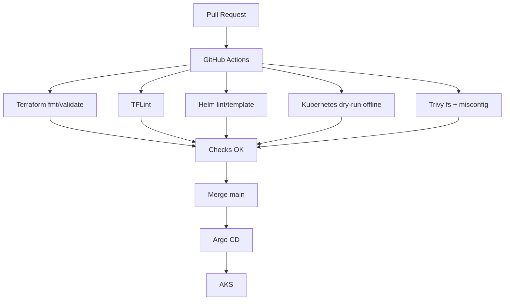

# EPIC 8 — Industrialisation CI/CD

> GitHub Actions · Terraform · Helm · Kubernetes validation · Trivy

---

## 01 / Objectif

Mettre en place une CI de validation continue alignée avec un déploiement GitOps opéré par Argo CD.

## 02 / Flux CI/CD

## 03 / Jobs GitHub Actions

| Job | Contrôle |
|---|---|
| image-strategy | Rappel stratégie image runtime officielle |
| terraform | fmt, init -backend=false, validate |
| helm | lint + template chart ERPNext et charts observability upstream épinglés |
| kubernetes | kubectl apply --dry-run=client --validate=false sur rendus Helm |
| security | Trivy scan filesystem + upload SARIF |

## 04 / Stratégie image ERPNext

- Image runtime : frappe/erpnext:v16.35.0.
- Registry runtime : public.
- Dockerfile custom ERPNext : absent au repository root.
- Build custom ERPNext en CI : non présent.
- Push image ERPNext vers ACR : non présent.
- ACR reste provisionné côté infrastructure pour usages futurs.

## 05 / Validation Kubernetes en CI

- Rendu Helm des manifests.
- Validation kubectl en mode dry-run client offline.
- Vérification structurelle des manifests sans interaction cluster runtime.

## 06 / Résultats sécurité CI

Référence de validation du LAB :
- vulnerabilities : 0
- misconfigurations HIGH/CRITICAL : 71

Lecture opérationnelle :
- Les findings de configuration restent un backlog sécurité à traiter.
- Le scan CI fournit une visibilité continue, pas une garantie de risque nul.

## 07 / Limites connues

- Aucun terraform apply dans la CI.
- Aucun helm upgrade/kubectl apply vers un cluster réel dans la CI.
- Validation Kubernetes limitée à un dry-run offline.

## 08 / Compétences

- GitHub Actions
- CI quality gates
- Terraform validation
- Helm validation
- Sécurité supply/config (Trivy)
- GitOps delivery model