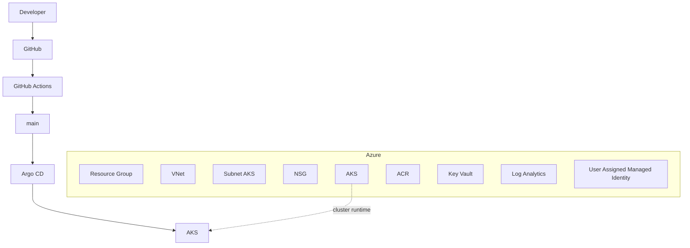
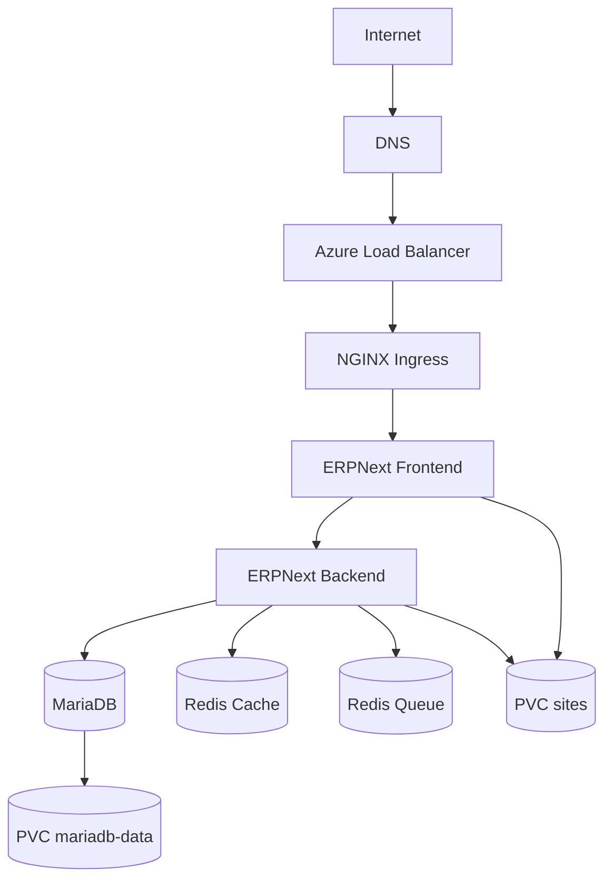

# EPIC 9 — Architecture finale ERPNext DevOps

> 🧭 Azure · AKS · GitOps · Observabilité · Sécurité

---

## 01 / Vue d'ensemble

La plateforme combine :
- Infrastructure Azure provisionnée par Terraform.
- Workloads ERPNext opérés sur AKS via Helm + Argo CD.
- Chaîne CI de validation sans déploiement direct.

## 02 / Architecture globale

## 03 / Flux principal utilisateur

## 04 / Composants techniques

| Domaine | Composants |
|---|---|
| Azure | RG, VNet, Subnet, NSG, AKS, ACR, Key Vault, Log Analytics, UAMI |
| ERPNext | frontend, backend, websocket, scheduler, queue-short, queue-long |
| Data | MariaDB StatefulSet, Redis cache, Redis queue |
| Jobs | configurator, site-init, assets-build |
| Plateforme | NGINX Ingress, cert-manager, Let's Encrypt, Argo CD |
| Observabilité | Prometheus, Grafana, Alertmanager, Loki, Alloy, kube-state-metrics, node-exporter |

## 05 / Stockage

| PVC | Taille | StorageClass | AccessMode | Usage |
|---|---|---|---|---|
| mariadb-data | 20Gi | managed-csi | ReadWriteOnce | Données MariaDB |
| sites | 20Gi | azurefile-csi | ReadWriteMany | Sites/Assets partagés |

Rappels :
- PV : volume persistant.
- PVC : claim consommé par les Pods.
- StorageClass : provisioning dynamique CSI.

## 06 / Sécurité

- SecurityContext durci sur workloads ERPNext.
- RBAC namespaced via ServiceAccounts et Role/RoleBinding.
- Workload Identity + OIDC + Federated Identity Credential.
- Key Vault + Secrets Store CSI Driver + SecretProviderClass.
- TLS via cert-manager + Let's Encrypt.
- Redirection HTTP→HTTPS + HSTS.

Flux secrets :

Workload → ServiceAccount → Workload Identity/OIDC → Managed Identity → Key Vault → CSI Driver → Workload

## 07 / Observabilité

- Métriques : Prometheus, kube-state-metrics, node-exporter.
- Logs : Alloy (DaemonSet) vers Loki.
- Visualisation : Grafana.
- Alerting : Alertmanager + PrometheusRule ERPNext.

Flux :

Workloads Kubernetes → Alloy → Loki → Grafana

Métriques Kubernetes → Prometheus → Grafana / Alertmanager

## 08 / CI/CD et GitOps

Pull Request → GitHub Actions (Terraform/TFLint/Helm/Kubernetes validation/Trivy) → main → Argo CD → AKS

Points clés :
- GitHub Actions valide, mais ne déploie pas sur cluster réel.
- Argo CD réalise la synchronisation runtime.
- kubectl en CI est utilisé en dry-run offline.

## 09 / Image runtime ERPNext

- Image active : frappe/erpnext:v16.35.0 (registre public).
- Dockerfile custom ERPNext : absent.
- Build/push d'image ERPNext vers ACR : non implémenté.
- ACR est provisionné dans Azure, sans usage actuel pour cette image runtime.

## 10 / Backup & DR

- Aucun mécanisme de backup/restore automatisé versionné n'est présent dans ce repository.
- Aucun test de restauration outillé n'est défini dans les assets CI/CD actuels.

## 11 / Limitations connues

- Les règles NetworkPolicy sont déclarées dans GitOps ; leur enforcement n'est pas démontré sur le dataplane réseau actuel du cluster.
- La validation Kubernetes CI reste offline et non runtime.
- Les findings Trivy de configuration constituent un backlog sécurité actif.

## 12 / Compétences

- Terraform / Azure
- AKS / Kubernetes
- Helm
- GitOps Argo CD
- Observabilité cloud-native
- Sécurité Kubernetes et identité Azure
- CI/CD technique