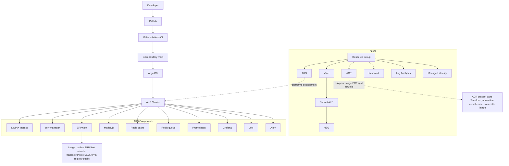
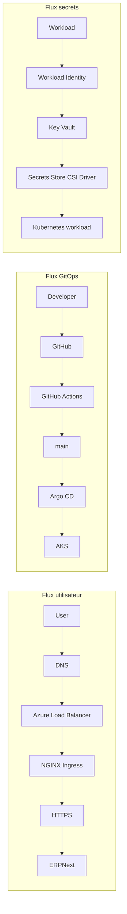

# EPIC 9 — Architecture finale du projet ERPNext DevOps

## 1. Objectif et périmètre

Ce document décrit l'architecture technique finale du LAB ERPNext DevOps à partir de l'état actuel du repository.

Périmètre strict :
- Documentation uniquement.
- Aucun changement d'infrastructure, de cluster, de manifests, ni de configuration runtime.

## 2. Inspection du repository (état constaté)

Les éléments suivants ont été inspectés avant rédaction :
- infrastructure/terraform
- K8S
- helm
- docs
- .github/workflows
- README.md

Constats structurants :
- La CI est centralisée dans .github/workflows/ci.yml.
- Le déploiement applicatif est piloté en GitOps via Argo CD.
- Le chart principal applicatif est helm/erpnext.
- L'observabilité est pilotée par des values Helm dédiées dans helm/observability.
- L'image ERPNext runtime configurée est frappe/erpnext:v16.35.0 (registry public).
- ACR est provisionné côté infrastructure Terraform, mais non utilisé actuellement pour pousser l'image ERPNext runtime.

## 3. Architecture globale

### 3.1 Chaîne de livraison

Developer
→ GitHub
→ GitHub Actions
→ Git repository (main)
→ Argo CD
→ AKS

### 3.2 Vue cloud et plateforme

- Azure
  - Resource Group
  - VNet
  - Subnet AKS
  - NSG
  - AKS
  - ACR
  - Key Vault
  - Log Analytics
  - Managed Identity
- AKS
  - NGINX Ingress
  - cert-manager
  - ERPNext workloads
  - MariaDB
  - Redis
  - Prometheus
  - Grafana
  - Loki
  - Alloy

### 3.3 Diagramme global (Mermaid)



## 4. Flux réseau

### 4.1 Flux utilisateur principal

Internet
→ DNS
→ Azure Load Balancer
→ NGINX Ingress
→ ERPNext frontend
→ ERPNext backend
→ MariaDB / Redis

### 4.2 TLS et certificats

Implémentation observée :
- HTTPS activé sur l'Ingress ERPNext.
- cert-manager utilisé.
- ClusterIssuer Let's Encrypt (production et staging présents).
- Redirection HTTP vers HTTPS.
- HSTS activé via annotations Ingress.

### 4.3 NetworkPolicies

Constat documenté et conservé :
- Les manifests NetworkPolicy existent (default deny ingress/egress + règles ciblées).
- Leur définition a été validée côté Kubernetes/GitOps.
- L'enforcement effectif dans le dataplane AKS du LAB n'a pas pu être démontré.

## 5. Stockage

### 5.1 Composants persistants réellement utilisés

| Composant | PVC | Taille | StorageClass | AccessMode | Usage |
|---|---|---|---|---|---|
| MariaDB | mariadb-data | 20Gi | managed-csi | ReadWriteOnce | Données MySQL |
| ERPNext sites/assets | sites | 20Gi | azurefile-csi | ReadWriteMany | Sites, assets partagés, données applicatives |

### 5.2 Chaînes de persistance

- MariaDB → PVC mariadb-data → managed-csi
- ERPNext sites/assets → PVC sites → azurefile-csi

### 5.3 Rappels techniques

- PV (PersistentVolume) : volume persistant fourni par la plateforme de stockage.
- PVC (PersistentVolumeClaim) : demande de stockage consommée par les Pods.
- StorageClass : profil de provisionnement dynamique du stockage.
- RWO (ReadWriteOnce) : un seul nœud monte le volume en lecture/écriture.
- RWX (ReadWriteMany) : plusieurs nœuds peuvent monter le volume en lecture/écriture.

## 6. Architecture ERPNext actuelle

Composants applicatifs réellement présents :

| Composant | Type | Rôle |
|---|---|---|
| frontend | Deployment | Exposition web ERPNext (Nginx) |
| backend | Deployment | API Frappe/ERPNext |
| websocket | Deployment | Temps réel (socket.io) |
| scheduler | Deployment | Planification des tâches |
| queue-short | Deployment | Workers tâches courtes / défaut |
| queue-long | Deployment | Workers tâches longues |
| MariaDB | StatefulSet | Base de données transactionnelle |
| Redis cache | Deployment | Cache applicatif |
| Redis queue | Deployment | Broker de file de tâches |
| configurator | Job | Configuration initiale de bench/site commune |
| site initialization | Job (PostSync) | Création/synchronisation du site ERPNext |
| assets build | Job (PostSync) | Compilation et copie des assets sur PVC partagé |

## 7. Observabilité

### 7.1 Stack observée

- Prometheus (kube-prometheus-stack)
- Grafana
- Alertmanager
- Loki
- Alloy (DaemonSet)
- kube-state-metrics
- node-exporter

### 7.2 Flux métriques et logs

- Workloads Kubernetes → Alloy → Loki → Grafana
- Métriques Kubernetes → Prometheus → Grafana / Alertmanager

### 7.3 Alertes présentes

Règles ERPNext et infrastructure observées :
- ERPNextDeploymentUnavailable
- ERPNextMariaDBUnavailable
- ERPNextPodCrashLooping
- ERPNextPodRestarting
- AKSNodeHighCPU
- AKSNodeHighMemory
- PersistentVolumeAlmostFull

## 8. Sécurité

Mécanismes implémentés et documentés :
- Pod Security Standards (audit/warn) au niveau namespace (lab)
- SecurityContext sur workloads applicatifs ERPNext
  - runAsNonRoot
  - runAsUser 1000
  - allowPrivilegeEscalation false
  - capabilities drop ALL
  - seccompProfile RuntimeDefault
- RBAC namespaced avec ServiceAccount dédiée et Role/RoleBinding
- NetworkPolicies (avec limite d'enforcement dataplane du LAB)
- Azure Key Vault
- AKS Workload Identity
- Managed Identity
- Secrets Store CSI Driver
- HTTPS via Ingress
- cert-manager + Let's Encrypt
- HSTS
- Démonstration de rotation de secret (EPIC sécurité)

### 8.1 Flux secrets (implémentation cible du lab)

Pod
→ ServiceAccount
→ OIDC Workload Identity
→ Federated Identity Credential
→ Managed Identity
→ Key Vault
→ Secrets Store CSI Driver
→ Pod

## 9. CI/CD + GitOps

### 9.1 Flux de changement

Pull Request
→ GitHub Actions
- Terraform
- TFLint
- Helm
- Kubernetes validation
- Trivy
→ merge main
→ Argo CD
→ AKS

### 9.2 Points importants

- GitHub Actions ne déploie pas sur cluster réel.
- Le workflow contient un kubectl apply uniquement en mode dry-run client offline.
- GitHub Actions ne fait pas helm upgrade sur AKS.
- Argo CD est responsable de la synchronisation et du déploiement.
- Image ERPNext actuelle : frappe/erpnext:v16.35.0.
- Aucun Dockerfile custom observé au repository root.
- ACR push : N/A pour l'image ERPNext actuelle.

## 10. Backup / DR

Documentation limitée aux éléments réellement observables :
- Aucun artefact EPIC 7 dédié Backup/DR n'est présent dans docs.
- Aucun workflow CI ni manifest Kubernetes dédié à une stratégie de backup/restauration automatisée n'est présent dans le repository.
- Le stockage managed-csi permet des capacités de snapshot côté plateforme Azure, mais aucune orchestration de sauvegarde versionnée dans ce dépôt n'est constatée.

## 11. Infrastructure as Code

### 11.1 Rôle de Terraform

Terraform couvre l'infrastructure Azure :
- Resource Group
- VNet
- Subnet AKS
- NSG + règles HTTP/HTTPS
- AKS
- ACR
- Key Vault
- Log Analytics
- Managed Identity
- Federated Identity Credentials

### 11.2 Séparation des responsabilités

Terraform
→ Infrastructure Azure

Helm + Kubernetes manifests + GitOps (Argo CD)
→ Workloads Kubernetes

## 12. Arborescence actuelle du repository

```text
ERPNext/
├── .github/
│   └── workflows/
│       └── ci.yml
├── docs/
│   ├── EPIC-1-discovery-architecture.md
│   ├── EPIC-2-infrastructure-terraform.md
│   ├── EPIC-3-bootstrap-aks.md
│   ├── EPIC-4-ERPNext-Kubernetes-GitOps.md
│   ├── EPIC-5-Observabilite.md
│   ├── EPIC-6-Securite.md
│   ├── EPIC-8-Industrialisation.md
│   └── EPIC-9-Architecture-Finale.md
├── infrastructure/
│   └── terraform/
├── K8S/
│   ├── argocd/
│   ├── cert-manager/
│   ├── erpnext/
│   └── ingress-nginx/
├── helm/
│   ├── erpnext/
│   └── observability/
├── password.txt
└── README.md
```

Note sur frappe_docker :
- Référencé dans README.md et .gitignore.
- Dossier non présent dans l'arborescence versionnée actuelle inspectée.

## 13. Limitations connues

Limitations effectivement identifiées dans les EPIC et dans l'état du repo :
- Enforcement NetworkPolicy non démontré dans le dataplane AKS du LAB.
- Validation Kubernetes en CI réalisée offline en dry-run client (pas une validation runtime cluster complète).
- Image ERPNext basée sur image officielle publique frappe/erpnext:v16.35.0.
- Absence de Dockerfile custom ERPNext au repository root.
- ACR non utilisé actuellement pour l'image ERPNext runtime.
- Absence d'artefacts versionnés dédiés à une stratégie Backup/DR automatisée.

## 14. Diagramme des flux principaux (Mermaid)



## 15. Conclusion

L'architecture actuelle est cohérente avec un modèle GitOps : CI de validation sans déploiement direct, synchronisation par Argo CD, stack applicative ERPNext complète sur AKS, observabilité active (métriques/logs/alerting), sécurité renforcée (PSS, SecurityContext, RBAC, Key Vault, Workload Identity, TLS) et limites clairement assumées pour le contexte LAB/portfolio.
