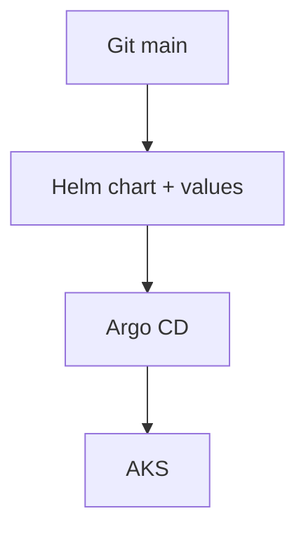
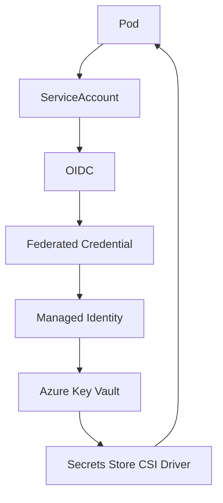
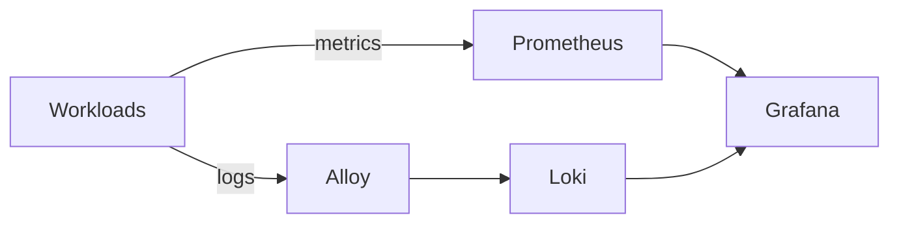
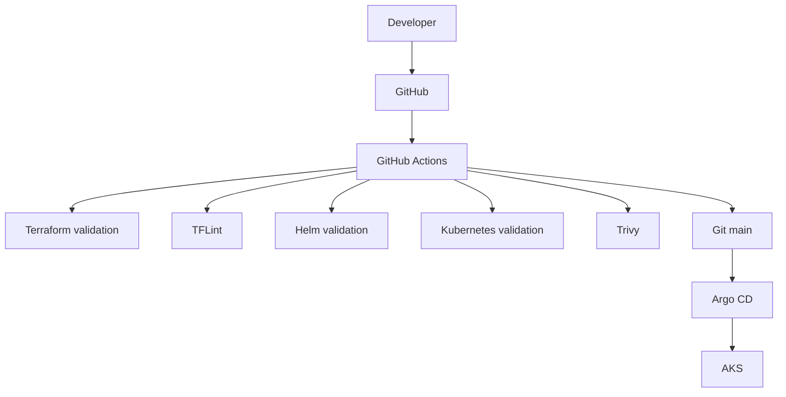

# EPIC 9 — Choix techniques & compromis

> Architecture · Décisions · Alternatives · Compromis

---

## 01 / Objectif

Présenter les décisions techniques structurantes du projet ERPNext DevOps sur Azure, les alternatives possibles, et les compromis retenus dans un contexte Cloud / DevOps.

---

## 02 / Vue d'ensemble des décisions

| Domaine | Choix |
|---|---|
| IaC | Terraform |
| Cloud | Microsoft Azure |
| Orchestration | AKS |
| Registry | Azure Container Registry (provisionné) |
| Packaging | Helm |
| GitOps | Argo CD |
| Ingress | NGINX Ingress |
| TLS | cert-manager + Let's Encrypt |
| Database | MariaDB |
| Cache / Queue | Redis |
| Secrets | Azure Key Vault + Secrets Store CSI Driver |
| Identity | Workload Identity + Managed Identity |
| Metrics | Prometheus |
| Dashboards | Grafana |
| Logs | Loki + Alloy |
| CI | GitHub Actions |
| Security scanning | Trivy |

---

## 03 / Infrastructure as Code — Terraform

Terraform est utilisé pour déclarer l'infrastructure Azure en code.

Points clés :
- Reproductibilité des environnements.
- Versionnement Git des changements d'infrastructure.
- Séparation claire entre infrastructure Azure et workloads Kubernetes.
- Workflow planifié avec validation avant exécution.
- Bonne intégration avec les ressources Azure du projet.

Alternatives :

| Solution | Caractéristique |
|---|---|
| Terraform | IaC multi-cloud et workflow plan/apply |
| Bicep | IaC native Azure |
| Azure Portal | Approche manuelle |
| Azure CLI | Approche scriptée, moins structurée qu'une base IaC complète |

Compromis retenu : Terraform ajoute une courbe d'apprentissage, mais apporte une base versionnée et réutilisable pour l'ensemble de la plateforme.

---

## 04 / Azure Kubernetes Service — AKS

AKS est utilisé pour orchestrer les workloads applicatifs et plateforme.

Pourquoi ce choix :
- Orchestration Kubernetes managée.
- Déploiement de services applicatifs découplés.
- Self-healing, rollout et scaling Kubernetes.
- Intégration avec les briques Azure (identité, réseau, monitoring).
- Séparation nette entre infrastructure Azure et applications conteneurisées.

Alternatives :
- Azure Container Apps.
- Azure Container Instances.
- Kubernetes auto-géré.

Compromis retenu : AKS apporte un cadre DevOps complet pour un projet pédagogique, avec une complexité opérationnelle plus élevée que des services conteneurs plus simples.

---

## 05 / Helm

Helm est utilisé pour packager et configurer ERPNext et les composants Kubernetes associés.

Apports :
- Templating des manifests.
- Paramétrage via values.yaml.
- Réutilisation des chart patterns.
- Gestion centralisée des configurations.

Alternatives :

| Approche | Caractéristique |
|---|---|
| Helm | Templating + packaging |
| YAML statique | Simplicité initiale, faible flexibilité |
| Kustomize | Overlay natif Kubernetes |

Compromis retenu : Helm augmente la flexibilité et la maintenabilité, au prix d'une couche supplémentaire de complexité.

---

## 06 / Argo CD — GitOps

Modèle de déploiement :

Principes retenus :
- Git comme source de vérité.
- Synchronisation automatique.
- selfHeal activé.
- prune activé.
- CI et CD séparés.

Pourquoi la CI ne déploie pas directement :
- GitHub Actions valide les artefacts.
- Argo CD applique l'état désiré depuis Git.
- Le modèle réduit la dérive entre cluster et repository.

---

## 07 / NGINX Ingress + cert-manager

NGINX Ingress :
- Point d'entrée HTTP/HTTPS.
- Routage vers les services ERPNext.

cert-manager :
- Gestion du cycle de vie des certificats.
- Intégration Let's Encrypt.
- Renouvellement automatique.

Compromis retenu :
- Gestion manuelle des certificats : simple au départ, coûteuse en exploitation.
- cert-manager : automatisation durable, avec dépendances supplémentaires.

---

## 08 / MariaDB + Redis

### MariaDB

- Base de données d'ERPNext.
- Déployée en StatefulSet.
- Persistance sur PVC dédié.

### Redis

- Redis cache pour les besoins applicatifs.
- Redis queue pour les files de traitement et la communication asynchrone.

Compromis retenu : séparation des rôles de données relationnelles et de messaging/cache, avec plus de composants à opérer.

---

## 09 / Stockage Kubernetes

Le projet distingue deux besoins de stockage :
- Données transactionnelles MariaDB.
- Partage de fichiers ERPNext entre plusieurs Pods.

| Ressource | Storage | Mode | Usage |
|---|---|---|---|
| MariaDB | managed-csi | RWO | données DB |
| Sites/assets | azurefile-csi | RWX | fichiers ERPNext |

Pourquoi ce choix :
- MariaDB privilégie la cohérence d'un volume bloc RWO.
- Sites/assets requiert un accès partagé RWX multi-Pods.

---

## 10 / Azure Key Vault + Workload Identity

Flux d'accès aux secrets :

Pourquoi cette approche :
- Éviter les credentials Azure statiques dans les Pods.
- Utiliser une identité workload fédérée.
- Centraliser les secrets dans Key Vault.

Comparaison rapide :

| Option | Caractéristique |
|---|---|
| Kubernetes Secret | Simple, mais secret local au cluster |
| Azure Key Vault | Référentiel de secrets centralisé |
| Workload Identity | Authentification Azure sans secret statique |

Compromis retenu : sécurité et traçabilité accrues, avec une intégration identité plus complexe.

---

## 11 / Sécurité Kubernetes

| Mécanisme | Pourquoi | Risque réduit | Compromis |
|---|---|---|---|
| Pod Security Standards | Encadrer les pratiques Pods | Exécution non conforme | Ajustements par workload |
| SecurityContext | Durcir l'exécution conteneur | Escalade de privilèges | Paramétrage plus strict |
| runAsNonRoot | Éviter root | Impact d'un conteneur compromis | Compatibilité images |
| allowPrivilegeEscalation=false | Bloquer élévation | Privilèges abusifs | Contraintes d'exécution |
| drop capabilities | Réduire privilèges Linux | Surface d'attaque kernel | Besoin de tuning applicatif |
| RBAC | Least privilege | Accès API excessifs | Gestion fine des rôles |
| NetworkPolicy | Contrôle des flux inter-pods | Mouvement latéral | Dépend de l'enforcement dataplane |

Point important : les NetworkPolicies sont déclarées dans GitOps, mais leur enforcement n'est pas démontré avec le dataplane réseau actuel du cluster.

---

## 12 / Observabilité

Rôles des composants :
- Prometheus : collecte de métriques.
- Grafana : visualisation.
- Alertmanager : gestion des alertes.
- Loki : stockage des logs.
- Alloy : collecte des logs.

Flux :

Compromis retenu : meilleure séparation des responsabilités, avec une pile opérationnelle plus riche à maintenir.

---

## 13 / GitHub Actions + Trivy

Séparation des responsabilités :
- GitHub Actions : validation CI.
- Argo CD : déploiement GitOps.

Contrôles CI présents :
- Terraform fmt.
- Terraform validate.
- TFLint.
- Helm lint.
- Kubernetes validation.
- Trivy.

Résultat sécurité observé :
- Le scan de configuration identifie des findings HIGH/CRITICAL.
- Ces résultats constituent un backlog de remédiation.

Compromis retenu : visibilité sécurité continue en CI, sans prétendre à un risque nul.

---

## 14 / Image ERPNext et ACR

État actuel :
- Image runtime : frappe/erpnext:v16.35.0.
- Dockerfile custom ERPNext : absent.
- Build custom ERPNext : non implémenté.
- Push vers ACR pour cette image runtime : non implémenté.

Positionnement d'ACR :
- ACR est provisionné côté infrastructure Terraform.
- La capacité est disponible pour une évolution vers une image custom.

Compromis :
- Image publique officielle : simplicité et vitesse d'adoption.
- Image custom dans ACR : plus de contrôle, mais plus de maintenance CI/CD.

---

## 15 / Choix de conception : CI vs CD

Lecture opérationnelle :
- CI vérifie.
- Git conserve l'état désiré.
- Argo CD déploie.

---

## 16 / Compromis du projet

| Décision | Avantage | Compromis |
|---|---|---|
| AKS | Kubernetes managé | coût et complexité |
| Terraform | IaC reproductible | courbe d'apprentissage |
| Helm | templating | complexité supplémentaire |
| Argo CD | GitOps / self-heal | composant supplémentaire |
| Key Vault | gestion centralisée des secrets | intégration Azure plus complexe |
| Prometheus/Grafana/Loki | observabilité complète | plusieurs composants |
| MariaDB StatefulSet | apprentissage de la persistance Kubernetes | administration plus complexe |
| NetworkPolicy | contrôle réseau déclaratif | dépend du dataplane |
| Image publique ERPNext | simplicité | moins de contrôle sur le build |
| ACR provisionné | capacité future | non utilisé actuellement |

---

## 17 / Limites actuelles

- Enforcement NetworkPolicy non démontré sur le dataplane réseau actuel.
- ACR non utilisé pour l'image runtime ERPNext.
- Absence de Dockerfile custom ERPNext.
- Findings Trivy HIGH/CRITICAL côté configuration.
- Pas de stratégie backup/restore/DR automatisée versionnée dans les assets actuels.

Impact principal : la plateforme est cohérente pour un LAB DevOps, mais certains volets restent à industrialiser.

---

## 18 / Évolutions possibles

- Construire une image ERPNext custom et la publier dans ACR.
- Activer un dataplane garantissant l'enforcement NetworkPolicy.
- Formaliser une stratégie backup/restore plus complète.
- Ajouter des tests DR automatisés.
- Renforcer la séparation d'environnements.
- Affiner les règles d'alerting.
- Étendre les scans vers des images custom.

---

## 19 / Questions d'entretien

### 1) Pourquoi Terraform ?
Terraform structure l'infrastructure Azure en code versionné. Le projet gagne en reproductibilité et en contrôle des changements via le workflow de validation.

### 2) Pourquoi AKS ?
AKS fournit un cluster Kubernetes managé adapté à un projet orienté orchestration, GitOps et exploitation cloud-native.

### 3) Pourquoi Helm ?
Helm simplifie la gestion de manifests ERPNext via templating et values, avec une configuration centralisée par environnement.

### 4) Pourquoi Argo CD ?
Argo CD applique le modèle GitOps, avec sync automatique, selfHeal et prune, en séparant validation CI et déploiement runtime.

### 5) Pourquoi Workload Identity ?
Workload Identity évite les credentials Azure statiques dans les Pods et s'appuie sur OIDC + Managed Identity.

### 6) Pourquoi MariaDB en StatefulSet ?
MariaDB nécessite une persistance stable. Le StatefulSet et le PVC RWO répondent au besoin de données transactionnelles.

### 7) Pourquoi Redis ?
Redis couvre le cache applicatif et les queues de traitement ERPNext. Il complète MariaDB, sans remplacer la base relationnelle.

### 8) Quelle différence entre CI et CD dans ce projet ?
GitHub Actions valide les artefacts (CI). Argo CD applique l'état désiré depuis Git vers AKS (CD GitOps).

### 9) Pourquoi ACR est présent alors que l'image runtime n'y est pas ?
ACR est provisionné pour une trajectoire future vers une image custom. Le runtime actuel reste sur l'image officielle publique.

### 10) Quelle limitation actuelle faut-il connaître ?
Les NetworkPolicies sont déclarées, mais l'enforcement dataplane n'est pas démontré. Le scan Trivy remonte aussi des findings de configuration à traiter.
