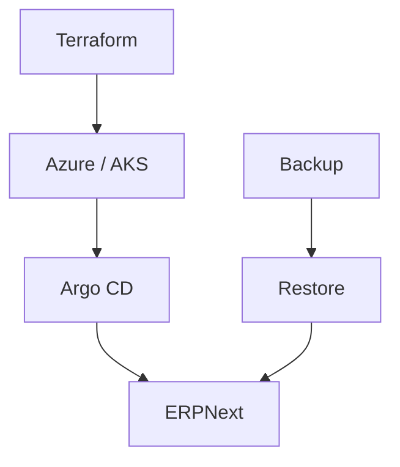
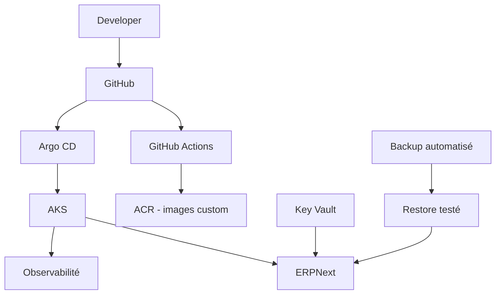

# EPIC 9 — Documentation finale

> Troubleshooting · Backup & DR · Coûts · Évolutions

---

## 01 / Méthode de diagnostic

Méthode opérationnelle recommandée sur cette plateforme :

1. Vérifier le cluster.
2. Vérifier les namespaces.
3. Vérifier les pods.
4. Vérifier les événements.
5. Vérifier les services et endpoints.
6. Vérifier les volumes.
7. Vérifier Ingress et TLS.
8. Vérifier Argo CD.
9. Vérifier les logs.
10. Vérifier metrics et dashboards.

Raisonnement à appliquer :

Symptôme
→ couche concernée
→ vérification cible
→ collecte logs/events
→ correction
→ validation post-correction

Commandes de base :

```bash
kubectl get nodes
kubectl get namespaces
kubectl get pods -A
kubectl get svc -A
kubectl get events -A --sort-by=.lastTimestamp
```

---

## 02 / Troubleshooting Kubernetes

| Symptôme | Vérifications | Commandes principales |
|---|---|---|
| Pod Pending | ressources, scheduling, PVC | kubectl describe pod, kubectl get pvc |
| CrashLoopBackOff | logs, events, config | kubectl logs, kubectl describe pod |
| ImagePullBackOff | nom image, accès registry | kubectl describe pod |
| Service inaccessible | selector, endpoints, ports | kubectl get svc, kubectl get endpoints |
| PVC Pending | StorageClass, provisioner, quotas | kubectl get pvc, kubectl get storageclass |
| Node NotReady | conditions node et events | kubectl describe node |

Exemples :

```bash
kubectl describe pod <pod-name> -n erpnext-gitops
kubectl logs <pod-name> -n erpnext-gitops --previous
kubectl get endpoints -n erpnext-gitops
kubectl get pvc -n erpnext-gitops
kubectl describe node <node-name>
```

---

## 03 / Troubleshooting ERPNext

Composants concernés :
- frontend
- backend
- websocket
- scheduler
- queue-short
- queue-long
- MariaDB
- Redis cache / Redis queue
- jobs d'initialisation

### ERPNext inaccessible

Chemin de contrôle :
Ingress → Service frontend → Pod frontend → backend

```bash
kubectl get ingress -n erpnext-gitops
kubectl get svc -n erpnext-gitops
kubectl get pods -n erpnext-gitops -l app=frontend
kubectl get pods -n erpnext-gitops -l app=backend
```

### Backend indisponible

Chemin de contrôle :
Pod backend → logs backend → config → MariaDB → Redis

```bash
kubectl logs deployment/backend -n erpnext-gitops
kubectl describe pod <backend-pod> -n erpnext-gitops
kubectl get pods -n erpnext-gitops -l app=mariadb
kubectl get pods -n erpnext-gitops -l app=redis-cache
kubectl get pods -n erpnext-gitops -l app=redis-queue
```

### MariaDB indisponible

Chemin de contrôle :
StatefulSet → Pod → PVC → logs

```bash
kubectl get statefulset mariadb -n erpnext-gitops
kubectl get pod -n erpnext-gitops -l app=mariadb
kubectl get pvc -n erpnext-gitops
kubectl logs statefulset/mariadb -n erpnext-gitops
```

### Queues problématiques

Chemin de contrôle :
Redis queue → queue workers → logs workers

```bash
kubectl get pods -n erpnext-gitops -l app=redis-queue
kubectl get pods -n erpnext-gitops -l app=queue-short
kubectl get pods -n erpnext-gitops -l app=queue-long
kubectl logs deployment/queue-short -n erpnext-gitops
kubectl logs deployment/queue-long -n erpnext-gitops
```

---

## 04 / Troubleshooting GitOps

Flux :
Git
→ GitHub Actions
→ main
→ Argo CD
→ Helm
→ AKS

Diagnostic par cas :
- OutOfSync : comparer état Git et état cluster via ressource Application.
- Sync Failed : inspecter erreur de rendu/sync dans les détails Application.
- Health Degraded : identifier le workload dégradé puis analyser pods/events.
- Helm rendering error : vérifier templates et values du chart.
- Job failed : inspecter logs du Job (configurator, site-init, assets-build).

Commandes :

```bash
kubectl get applications -n argocd
kubectl describe application erpnext -n argocd
kubectl get pods -n erpnext-gitops
kubectl logs job/configurator -n erpnext-gitops
kubectl logs job/erpnext-site-init -n erpnext-gitops
kubectl logs job/erpnext-assets-build -n erpnext-gitops
```

---

## 05 / Troubleshooting HTTPS

Chaîne de diagnostic :
DNS
→ Load Balancer
→ NGINX
→ Ingress
→ Certificate
→ HTTPS

Commandes :

```bash
kubectl get ingress -n erpnext-gitops
kubectl describe ingress erpnext -n erpnext-gitops
kubectl get certificate -A
kubectl describe certificate erpnext-production-tls -n default
kubectl get clusterissuer
kubectl describe clusterissuer letsencrypt-production
```

Vérification endpoint :

```bash
curl -I https://erp-dev.shopvelmoria.store
```

---

## 06 / Troubleshooting Secrets

Flux :
Pod
→ ServiceAccount
→ Workload Identity
→ Managed Identity
→ Key Vault
→ CSI Driver

Cas à diagnostiquer :
- secret absent dans le pod.
- SecretProviderClass incorrect.
- identité non autorisée côté Key Vault.
- montage CSI échoué.

Commandes :

```bash
kubectl get sa -n erpnext-gitops
kubectl get secretproviderclass -n erpnext-gitops
kubectl describe secretproviderclass erpnext-keyvault -n erpnext-gitops
kubectl describe pod <pod-name> -n erpnext-gitops
```

Règle de sécurité : ne jamais afficher la valeur d'un secret.

---

## 07 / Troubleshooting Observabilité

### Metrics

Workload
→ Prometheus
→ Grafana

### Logs

Pod
→ Alloy
→ Loki
→ Grafana

Cas fréquents :
- logs absents.
- métriques absentes.
- dashboard vide.
- alertes absentes.

Commandes :

```bash
kubectl get pods -n monitoring
kubectl get svc -n monitoring
kubectl get prometheus -n monitoring
kubectl get alertmanager -n monitoring
kubectl get prometheusrules -n monitoring
kubectl get pods -n monitoring -l app.kubernetes.io/name=alloy
```

---

## 08 / État actuel Backup / Restore / DR

### Implémenté
- Persistance MariaDB via PVC dédié.
- Persistance sites/assets ERPNext via PVC dédié.

### Provisionné
- Infrastructure reproductible via Terraform.
- Redéploiement applicatif via GitOps (Argo CD).

### Testé
- Validation CI des manifests et de la cohérence des configurations.

### Non démontré
- Stratégie automatisée complète de backup/restore.
- Tests complets de restauration de données en bout en bout.

Une stratégie automatisée complète de sauvegarde et de restauration n'est pas démontrée dans le périmètre actuel.

---

## 09 / Données critiques

| Donnée | Stockage | Criticité | Protection actuelle |
|---|---|---|---|
| MariaDB | PVC mariadb-data (managed-csi, RWO) | Très élevée | persistance Kubernetes |
| Sites ERPNext | PVC sites (azurefile-csi, RWX) | Élevée | persistance Kubernetes |
| Assets/fichiers | PVC sites (azurefile-csi, RWX) | Élevée | persistance Kubernetes |
| Configuration Kubernetes | Git + manifests Helm/K8S | Élevée | versionnement Git |
| Secrets applicatifs | Kubernetes Secret / Key Vault selon mode | Très élevée | secret management Kubernetes et intégration Key Vault |

---

## 10 / Stratégie de Backup

### Actuel
- Persistance assurée par les PVC.
- Aucune chaîne automatisée complète de backup/restore n'est décrite comme opérationnelle.

### Cible
- Sauvegarde logique MariaDB planifiée.
- Sauvegarde des données applicatives persistantes.
- Politique de rétention.
- Procédure de restauration testée régulièrement.
- Industrialisation possible avec snapshots CSI, stockage objet ou outil dédié.

Ces éléments cibles ne sont pas présentés comme déployés aujourd'hui.

---

## 11 / Restore

Principe cible de restauration :
Backup
→ restauration stockage/base
→ validation technique
→ validation applicative
→ test fonctionnel

État actuel :
- Aucun test complet de restauration n'est documenté comme exécuté de manière régulière.

---

## 12 / Disaster Recovery

Concepts :
- RPO : objectif de perte de données acceptable.
- RTO : objectif de reprise acceptable.

État actuel :
- Valeurs chiffrées RPO/RTO non formalisées.

Schéma conceptuel DR :



### Automatisé aujourd'hui
- Recréation infrastructure par Terraform.
- Redéploiement workloads par Argo CD à partir de Git.

### À industrialiser
- Orchestration backup/restore des données.
- Validation DR périodique.

---

## 13 / Plan de reprise

### Scénario
Perte du cluster AKS.

### Étapes
1. Recréer l'infrastructure avec Terraform.
2. Recréer/reconnecter les composants plateforme nécessaires.
3. Restaurer les données persistantes selon la stratégie disponible.
4. Laisser Argo CD redéployer les workloads.
5. Vérifier les PVC.
6. Vérifier MariaDB.
7. Vérifier ERPNext.
8. Vérifier HTTPS.
9. Vérifier observabilité.
10. Exécuter un test fonctionnel.

Distinction importante :
- Recréation infrastructure et redéploiement GitOps : supportés.
- Restauration de données automatisée testée de bout en bout : non démontrée.

---

## 14 / Principaux postes de coût

Postes Azure principaux :
- AKS
- VM du node pool
- Managed Disks
- Azure Files
- Load Balancer
- Log Analytics
- ACR
- Key Vault
- réseau/transfert selon usage

---

## 15 / Analyse qualitative des coûts

| Composant | Impact potentiel | Commentaire |
|---|---|---|
| AKS | élevé | cluster et compute |
| Storage | moyen | volumes persistants DB + fichiers |
| Log Analytics | variable | dépend de l'ingestion et de la rétention |
| ACR | faible à moyen | dépend de l'utilisation réelle |
| Key Vault | faible | dépend du volume d'opérations |
| Load Balancer | faible à moyen | exposition publique |

---

## 16 / Optimisation des coûts

Leviers possibles :
- arrêter les environnements de lab hors usage.
- ajuster CPU/mémoire des workloads.
- ajuster le nombre de nœuds.
- limiter la rétention et l'ingestion logs/metrics.
- calibrer les ressources de monitoring.
- séparer dev/staging/production selon besoin réel.

Ces leviers sont des pistes d'optimisation, pas un état présenté comme déjà mis en œuvre.

---

## 17 / Roadmap technique

Évolutions possibles :

- Images : construire une image ERPNext custom et la publier dans ACR.
- Sécurité : renforcer l'enforcement NetworkPolicy avec dataplane compatible.
- Backup : industrialiser une stratégie automatisée backup/restore.
- DR : automatiser et tester régulièrement le scénario de reprise.
- CI/CD : ajouter des scans d'images si images custom introduites.
- Observabilité : enrichir dashboards et règles d'alerte.
- Environnements : séparation plus stricte des environnements.

---

## 18 / Architecture cible (future)

Le schéma suivant représente une cible d'évolution, distincte de l'architecture actuelle :



---

## 19 / Architecture finale du projet

Synthèse courte :
Azure
→ AKS
→ GitOps
→ ERPNext
→ Observabilité
→ Sécurité

| Domaine | Composants principaux |
|---|---|
| Infra | Terraform, Azure RG/VNet/AKS/ACR/Key Vault |
| Orchestration | AKS, Deployments, StatefulSet, PVC |
| Déploiement | Helm, Argo CD, Git main |
| Application | ERPNext frontend/backend/workers, MariaDB, Redis |
| Observabilité | Prometheus, Grafana, Alertmanager, Loki, Alloy |
| Sécurité | PSS, SecurityContext, RBAC, Workload Identity, TLS |

---

## 20 / Ce que le projet démontre

Compétences mises en pratique :
- Azure
- Terraform
- Kubernetes
- AKS
- Helm
- Argo CD
- GitOps
- CI/CD
- observabilité
- sécurité Kubernetes
- Azure Key Vault
- Workload Identity
- troubleshooting
- stockage persistant
- documentation technique

---

## 21 / Limites connues

- Enforcement NetworkPolicy non démontré.
- ACR non utilisé pour l'image ERPNext runtime.
- Absence de Dockerfile custom ERPNext.
- Limites Backup/DR sur l'automatisation et les tests de restauration.
- Findings Trivy HIGH/CRITICAL connus côté configuration.

---

## 22 / Conclusion

La plateforme constitue une base Cloud/DevOps complète pour pratiquer Infrastructure as Code, Kubernetes, GitOps, observabilité, sécurité, CI/CD et exploitation. Le socle technique est opérationnel pour un lab, avec des axes d'industrialisation clairement identifiés.

---

## 23 / Questions clés

### Comment diagnostiquer un Pod en CrashLoopBackOff ?
Identifier le pod, lire logs et events, puis corriger la configuration ou la dépendance manquante. Valider par un rollout stable.

### Comment diagnostiquer un PVC Pending ?
Vérifier StorageClass, provisioner, événements namespace et capacité disponible. Confirmer ensuite le passage en Bound.

### Comment fonctionne le GitOps dans ce projet ?
Git stocke l'état désiré. Argo CD synchronise cet état vers AKS. GitHub Actions valide en amont.

### Que faire si Argo CD est OutOfSync ?
Comparer état Git et état cluster via la ressource Application, puis corriger la source ou resynchroniser selon la cause.

### Comment fonctionne le flux Key Vault vers Pod ?
ServiceAccount + Workload Identity permettent l'accès à Key Vault. Le CSI Driver monte les secrets côté pod.

### Quelle est la stratégie actuelle de Backup/DR ?
Persistance des données via PVC. Stratégie automatisée complète de backup/restore non démontrée.

### Quel est le RPO/RTO actuel ?
Aucune valeur officielle chiffrée n'est formalisée dans le périmètre actuel.

### Quels sont les principaux coûts Azure ?
AKS/compute, stockage persistant, observabilité (Log Analytics), et composants de plateforme exposés.

### Quelles sont les principales limites actuelles ?
NetworkPolicy non démontré, image publique ERPNext, pas de Dockerfile custom, backup/restore à industrialiser.

### Que changer pour un contexte production ?
Industrialiser backup/restore/DR, renforcer sécurité réseau, introduire images custom maîtrisées, et formaliser la gouvernance des environnements.
