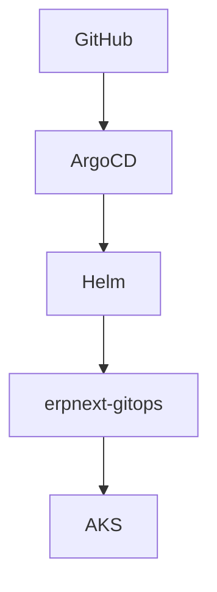

# EPIC 9 — Guide de déploiement & exploitation

> Runbook technique · Déploiement · Vérification · Exploitation

---

## 01 / Vue d'ensemble

Cycle de plateforme :

Terraform
→ Azure
→ AKS
→ Bootstrap
→ Argo CD
→ Helm
→ ERPNext
→ Observabilité

Rôle de chaque étape :
- Terraform : provisionnement de l'infrastructure Azure.
- AKS : exécution des workloads Kubernetes.
- Bootstrap : composants de plateforme (ingress, certificats, GitOps).
- Argo CD : synchronisation GitOps vers le cluster.
- Helm : packaging et templating des manifests.
- ERPNext : application métier (frontend, backend, workers, DB, cache/queue).
- Observabilité : métriques, logs, alertes.

---

## 02 / Prérequis

| Outil | Utilisation |
|---|---|
| Azure CLI | authentification et opérations Azure |
| Terraform | provisionnement infrastructure |
| kubectl | administration Kubernetes |
| Helm | rendu et validation chart |
| Git | gestion de l'état désiré |

Versions de référence observées dans la CI :
- Terraform : 1.15.0
- Helm : v3.15.4
- kubectl : v1.32.0

Pré-requis d'accès :
- accès au repository GitHub.
- accès Azure avec droits sur le Resource Group du projet.

---

## 03 / Structure du projet

| Répertoire | Rôle |
|---|---|
| infrastructure/terraform | ressources Azure (RG, réseau, AKS, ACR, Key Vault, identité, monitoring) |
| K8S | manifests Kubernetes de plateforme et GitOps |
| helm | chart ERPNext et valeurs observabilité |
| docs | documentation technique |
| .github/workflows | pipeline CI GitHub Actions |

---

## 04 / Déploiement de l'infrastructure

Répertoire de travail :

```bash
cd infrastructure/terraform
```

Workflow Terraform :

```bash
terraform init
terraform fmt
terraform validate
terraform plan
terraform apply
```

Rôle des commandes :
- `init` : initialise providers/modules.
- `fmt` : normalise le code Terraform.
- `validate` : contrôle la cohérence syntaxique et structurelle.
- `plan` : affiche les changements prévus.
- `apply` : applique les changements.

Outputs utiles (sans afficher de secrets) :

```bash
terraform output resource_group_name
terraform output aks_name
terraform output acr_login_server
terraform output key_vault_name
terraform output managed_identity_name
terraform output aks_oidc_issuer_url
```

---

## 05 / Vérification Azure

Vérifications minimales après Terraform :

```bash
az account show --output table
az group show --name <resource-group> --output table
az aks show --resource-group <resource-group> --name <aks-name> --output table
az acr show --resource-group <resource-group> --name <acr-name> --output table
az keyvault show --resource-group <resource-group> --name <keyvault-name> --output table
az identity list --resource-group <resource-group> --output table
```

Points à contrôler :
- Resource Group présent.
- Cluster AKS provisionné.
- ACR provisionné.
- Key Vault provisionné.
- Managed Identity présente.
- Réseau associé au cluster.

---

## 06 / Connexion au cluster AKS

Récupération des credentials :

```bash
az aks get-credentials --resource-group <resource-group> --name <aks-name> --overwrite-existing
```

Vérification de connectivité :

```bash
kubectl cluster-info
kubectl get nodes
```

Attendu :
- API server joignable.
- Nœuds en état `Ready`.

---

## 07 / Vérification du cluster

Checklist de base :

```bash
kubectl get nodes
kubectl get namespaces
kubectl get pods -A
kubectl get svc -A
```

Sortie saine attendue :
- nœuds `Ready`.
- namespaces de plateforme présents.
- pods critiques sans boucle d'erreur.
- services exposés dans les namespaces attendus.

---

## 08 / Bootstrap Kubernetes

Composants plateforme à vérifier :
- ingress-nginx
- cert-manager
- Argo CD

Vérification par namespace :

```bash
kubectl get pods -n ingress-nginx
kubectl get pods -n cert-manager
kubectl get pods -n argocd
```

Lecture opérationnelle :
- contrôleurs disponibles.
- pods `Running`.
- absence d'erreurs persistantes de redémarrage.

---

## 09 / Argo CD

Application GitOps ERPNext :
- repository : GitHub ERPnext-DevOps.
- path : `helm/erpnext`.
- namespace cible : `erpnext-gitops`.
- sync policy : automated + selfHeal + prune.

Flux :



Commandes utiles :

```bash
kubectl get applications -n argocd
kubectl describe application erpnext -n argocd
```

---

## 10 / Déploiement ERPNext

Le déploiement applicatif suit le modèle GitOps via Argo CD.

Éléments principaux :
- chart Helm : `helm/erpnext`.
- valeurs : `values.yaml` + valeurs dédiées selon contexte.
- namespace runtime : `erpnext-gitops`.

Composants attendus :
- frontend
- backend
- websocket
- scheduler
- queue-short
- queue-long
- MariaDB
- Redis cache
- Redis queue
- jobs d'initialisation (configurator, site-init, assets-build)

---

## 11 / Vérification ERPNext

Checklist applicative :

```bash
kubectl get pods -n erpnext-gitops
kubectl get svc -n erpnext-gitops
kubectl get pvc -n erpnext-gitops
kubectl get ingress -n erpnext-gitops
kubectl get certificate -n erpnext-gitops
kubectl get applications -n argocd
```

Contrôles :
- pods applicatifs `Running`.
- jobs `Completed` selon leur cycle.
- PVC en `Bound`.
- Ingress présent.
- certificat `Ready`.
- Application Argo CD `Synced` et `Healthy`.

Vérification HTTPS (domaine documenté) :

```bash
curl -I https://erp-dev.shopvelmoria.store
```

---

## 12 / TLS et certificats

Composants :
- Ingress NGINX.
- cert-manager.
- ClusterIssuer Let's Encrypt.
- Certificate.
- Secret TLS.

Diagnostic :

```bash
kubectl get clusterissuer
kubectl describe clusterissuer letsencrypt-production
kubectl get certificate -A
kubectl describe certificate erpnext-production-tls -n default
kubectl get secret erpnext-production-tls -n erpnext-gitops
```

Objectif de vérification :
- issuer prêt.
- certificat émis/renouvelable.
- secret TLS présent dans le namespace de service.

---

## 13 / Stockage

PVC attendus :
- `mariadb-data` (managed-csi, RWO)
- `sites` (azurefile-csi, RWX)

Commandes :

```bash
kubectl get pvc -n erpnext-gitops
kubectl get pv
```

Si un PVC reste `Pending` :
- vérifier StorageClass disponible.
- vérifier quotas et capacité.
- consulter les événements du namespace.

```bash
kubectl get storageclass
kubectl get events -n erpnext-gitops --sort-by=.lastTimestamp
```

---

## 14 / Secrets et Key Vault

Flux cible :

ServiceAccount
→ OIDC Workload Identity
→ Managed Identity
→ Key Vault
→ Secrets Store CSI Driver
→ Pod

Commandes de diagnostic :

```bash
kubectl get sa -n erpnext-gitops
kubectl get secretproviderclass -n erpnext-gitops
kubectl describe secretproviderclass erpnext-keyvault -n erpnext-gitops
kubectl describe pod <pod-name> -n erpnext-gitops
```

Règle d'exploitation :
- ne jamais afficher la valeur d'un secret.

---

## 15 / Observabilité

Composants :
- Prometheus
- Grafana
- Alertmanager
- Loki
- Alloy

### Metrics

Workloads
→ Prometheus
→ Grafana / Alertmanager

### Logs

Pods
→ Alloy
→ Loki
→ Grafana

Vérifications namespace monitoring :

```bash
kubectl get pods -n monitoring
kubectl get svc -n monitoring
kubectl get prometheus -n monitoring
kubectl get alertmanager -n monitoring
kubectl get prometheusrules -n monitoring
```

---

## 16 / Opérations courantes

### Voir les pods

```bash
kubectl get pods -n erpnext-gitops
```

### Voir les logs

```bash
kubectl logs deployment/backend -n erpnext-gitops
kubectl logs statefulset/mariadb -n erpnext-gitops
```

### Suivre les logs

```bash
kubectl logs -f deployment/frontend -n erpnext-gitops
```

### Voir les événements

```bash
kubectl get events -n erpnext-gitops --sort-by=.lastTimestamp
```

### Redémarrer un Deployment

```bash
kubectl rollout restart deployment/backend -n erpnext-gitops
```

Risque : redémarrage temporaire du composant ciblé.

### Vérifier le rollout

```bash
kubectl rollout status deployment/backend -n erpnext-gitops
```

---

## 17 / Modifier ERPNext

Workflow GitOps de changement :
1. Modifier chart/values/manifests dans Git.
2. Commit.
3. Push vers `main`.
4. GitHub Actions valide.
5. Argo CD détecte le changement.
6. Argo CD synchronise AKS.
7. Vérifier le rollout et l'état applicatif.

Principe : Git reste la source de vérité ; éviter les modifications directes durables dans le cluster.

---

## 18 / Rollback

Rollback GitOps recommandé :

Commit précédent connu
→ revert Git / retour à une révision stable
→ push
→ validation CI
→ synchronisation Argo CD
→ retour de l'état cluster

Pourquoi : dans cette architecture, l'état désiré est piloté par Git et appliqué par Argo CD.

---

## 19 / Troubleshooting

| Symptôme | Vérifications |
|---|---|
| Pod Pending | `kubectl get pvc -n erpnext-gitops`, `kubectl get events -n erpnext-gitops --sort-by=.lastTimestamp` |
| Pod CrashLoopBackOff | `kubectl logs <pod> -n erpnext-gitops`, `kubectl describe pod <pod> -n erpnext-gitops` |
| MariaDB indisponible | `kubectl get statefulset mariadb -n erpnext-gitops`, `kubectl logs statefulset/mariadb -n erpnext-gitops` |
| ERPNext inaccessible | `kubectl get ingress -n erpnext-gitops`, `kubectl get svc -n erpnext-gitops`, `kubectl get pods -n erpnext-gitops` |
| HTTPS incorrect | `kubectl get certificate -A`, `kubectl describe clusterissuer letsencrypt-production`, `kubectl describe ingress erpnext -n erpnext-gitops` |
| Secret absent | `kubectl get secretproviderclass -n erpnext-gitops`, `kubectl describe pod <pod> -n erpnext-gitops` |
| Argo OutOfSync | `kubectl get applications -n argocd`, `kubectl describe application erpnext -n argocd` |
| Logs absents | `kubectl get pods -n monitoring`, `kubectl get pods -n monitoring -l app.kubernetes.io/name=alloy` |
| Metrics absentes | `kubectl get prometheus -n monitoring`, `kubectl get servicemonitor -A` |

---

## 20 / Limites opérationnelles

- Enforcement NetworkPolicy non démontré avec le dataplane réseau actuel.
- ACR non utilisé pour l'image runtime ERPNext.
- Aucun Dockerfile custom ERPNext au repository root.
- Stratégie backup/restore/DR automatisée non versionnée dans les assets actuels.
- Findings Trivy HIGH/CRITICAL connus côté configuration.

---

## 21 / Checklist finale

### Infrastructure

- [ ] Terraform validé
- [ ] AKS disponible
- [ ] nodes Ready

### Kubernetes

- [ ] ingress-nginx disponible
- [ ] cert-manager disponible
- [ ] Argo CD disponible

### ERPNext

- [ ] Argo Synced
- [ ] Argo Healthy
- [ ] pods opérationnels
- [ ] PVC Bound
- [ ] HTTPS fonctionnel

### Observabilité

- [ ] Prometheus opérationnel
- [ ] Grafana opérationnel
- [ ] Loki opérationnel
- [ ] logs ERPNext visibles
- [ ] alertes chargées

---

## 22 / Commandes de référence

```bash
# Cluster
kubectl get nodes
kubectl get pods -A

# ERPNext
kubectl get pods -n erpnext-gitops
kubectl get svc -n erpnext-gitops
kubectl get pvc -n erpnext-gitops
kubectl get ingress -n erpnext-gitops

# Argo CD
kubectl get applications -n argocd
kubectl describe application erpnext -n argocd

# TLS
kubectl get clusterissuer
kubectl get certificate -A

# Observabilité
kubectl get pods -n monitoring

# Diagnostic
kubectl get events -n erpnext-gitops --sort-by=.lastTimestamp
kubectl logs -f deployment/backend -n erpnext-gitops
```